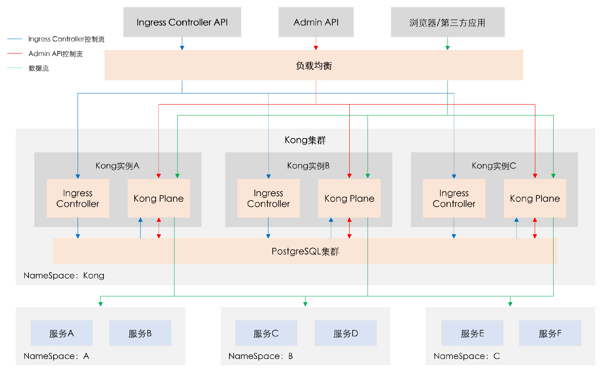

# Kong系列-01-介绍

### Kong的由来

- Nginx是模块化设计的反向代理软件，C语言开发。
- Lua是一个小巧的脚本语言，C语言开发，Lua脚本可以容易的被C/C++代码调用，也可以反过来调用C/C++的函数。
- 通过lua-nginx-module模块将luaJIT解释器集成进Nginx，使得Nginx可以执行Lua脚本，灵活但不宜用。
- OpenResty是一个基于Nginx与Lua的高性能Web平台，其中内部集成了大量精良的Lua库，第三方模块以及大多数的依赖项。用于方便地搭建能够处理超高并发，扩展性极高的动态Web应用、Web服务和动态网关。
- 在Nginx上直接使用Lua开发难度比较大，OpenResty集成大量Lua库，第三方模块和所需的依赖项，这样使用Lua开发功能变得更加容易。
- Kong是一个基于OpenResty开发的应用，可以认为是一个Web Server，更进一步是一个API Gateway，具有API管理和请求代理的功能。
- 可以举个例子：Nginx是OS，Lua是编程语言，OpenResty是开发平台或者框架，Kong是一个OpenResty之上的应用。

### Kong版本

Kong是由Kong Inc.开源的API网关项目，其在Github上有24.1K Star。

Kong版本，0.10.0(2017-03-07) -- 1.4.0(2019-10-24) 一共发布29个版本，其中1个x版本，10个y版本，18个z版本。

Kong有社区版本Kong Gateway，收费版本Kong Enterprise。Kong网关本身是开源免费的，Kong Enterprise主要在Kong的管理工具、开发工具，企业级插件方面。

### Kong特性

- 云原生(Cloud-Native)：Kong可以在Kubernetes或裸机上运行；
- 动态负载平衡(Dynamic Load Balancing)：跨多个上游服务的负载平衡业务。
- 基于哈希的负载平衡(Hash-based Load Balancing)：一致的散列/会话亲和的负载平衡。
- 断路器(Circuit-Breaker)：智能跟踪不健康的上游服务。
- 健康检查(Health Checks)：主动和被动监控您的上游服务。
- 服务发现(Service Discovery)：解决如Consul等第三方DNS解析器的SRV记录。
- 无服务器(Serverless)：从Kong中直接调用和保证AWS或OpenWhisk函数安全。
- WebSockets：通过WebSockets与上游服务进行通信。
- OAuth2.0：轻松的向API中添加OAuth2.0认证。
- 日志记录(Logging)：通过HTTP、TCP、UDP记录请求或者相应的日志，存储在磁盘中。
- 安全(Security)：ACL，Bot检测，IPs白名单/黑名单等。
- 系统日志(Syslog)：记录信息到系统日志。
- SSL：为基础服务或API设置特定的SSL证书。
- 监视(Monitoring)：能够实时对关键负载和性能指标进行监控。
- 转发代理(Forward Proxy)：使端口连接到中间透明的HTTP代理。
- 认证(Authentications)：支持HMAC，JWT和BASIC方式进行认证等等。
- 速率限制(Rate-limiting)：基于多个变量的阻塞和节流请求。
- 转换(Transformations)：添加、删除或操作HTTP请求和响应。
- 缓存(Caching)：在代理层进行缓存和服务响应。
- 命令行工具(CLI)：能够通过命令行控制Kong的集群。
- REST API：可以通过REST API灵活的操作Kong。
- GEO复制：在不同的区域，配置总是最新的。
- 故障检测与恢复(Failure Detection & Recovery)：如果Cassandra节点失效，Kong并不会受影响。
- 群集(Clustering)：所有的Kong节点会自动加入群集，并更新各个节点上的配置。
- 可扩展性(Scalability)：通过添加节点，实现水平缩放。
- 性能(Performance)：通过缩放和使用Nigix，Kong能够轻松处理负载。
- 插件(Plugins)：基于插件的可扩展体系结构，能够方便的向Kong和API添加功能。

### Kong部署场景

| 场景 | OS | Docker | Kubernetes |
| :------| :------ | :------ | :------ |
| DB-less无数据库 | Declarative Config | Declarative Config | Declarative Config Ingress Controller （Kubernetes下推荐无数据库方式） |
| PostgreSQL | 管理API | 管理API | Ingress Controller 管理API |
| Cassandra | 管理API | 管理API | 不推荐 |

Kong以前只支持数据库方式，配置数据（路由规则，Service等）存放在数据库中，Kong各节点从数据库中同步配置数据以保持配置数据一致性。从1.1.0版本开始，Kong开始支持无数据方式，无数据库方式的配置数据存放在声明式配置文件中，Kong各个节点完全独立。

Kong有三种配置管理方式：

- 管理API方式：Kong的标准管理方式，Kong的配置数据都是通过调用Kong提供的Rest API进行管理，最终配置都存放在数据库中，Kong集群实例从数据库读取配置。
- 声明式配置文件Declarative Config：在无数据库方式下，Kong提供一种声明式配置文件，配置数据在文件中声明，然后通过文件或者Rest API的方式一次性加载到Kong中。
- Ingress Controller：Kong在Kubernetes下支持Ingress Controller，Kong还定义了多个自定义资源CRDs，配置数据通过这些CRDs进行配置。

以下Kong的部署架构。

