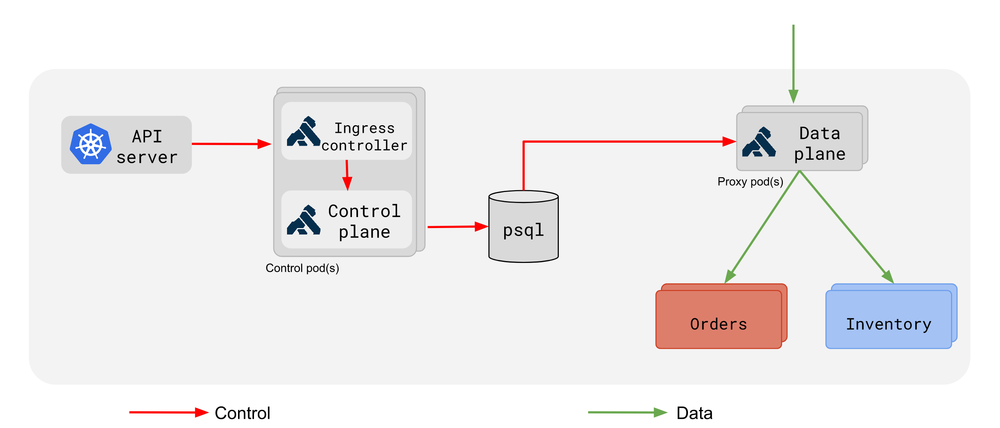

# Kong系列-04-Helm安装Kong 1.3.0 with PostgreSQL and with Ingress Controller

系统环境。

    kubeadm version
    kubeadm version: &version.Info{Major:"1", Minor:"16", GitVersion:"v1.16.4", GitCommit:"224be7bdce5a9dd0c2fd0d46b83865648e2fe0ba", GitTreeState:"clean", BuildDate:"2019-12-11T12:44:45Z", GoVersion:"go1.12.12", Compiler:"gc", Platform:"linux/amd64"}
    
    helm version
    version.BuildInfo{Version:"v3.0.1", GitCommit:"7c22ef9ce89e0ebeb7125ba2ebf7d421f3e82ffa", GitTreeState:"clean", GoVersion:"go1.13.4"}
    
    helm repo list
    NAME            URL
    stable          https://kubernetes-charts.storage.googleapis.com
    aliyuncs        https://apphub.aliyuncs.com
    bitnami         https://charts.bitnami.com/bitnami

由于需要安装PostgreSQL数据库，需要使用StorageClass动态存储卷，我们采用NFS共享文件系统来搭建共享存储卷。NFS服务器的安装请参见[nfs v4安装和使用-CentOS](../nfs/nfs-v4-centos-installation-introduction.md)。

NFS服务器安装完成后，为Kong创建共享文件系统。

    mkdir /data/kong -p
    
    chmod 777 /data/kong/
    
    vi /etc/exports
    /data/kong                        192.168.1.0/24(sync,rw,no_root_squash,no_subtree_check)
    
    exportfs -r
    
    showmount -e 192.168.1.80
    Export list for nfs:
    /data/kong     192.168.1.0/24

在Kubernetes集群所有节点安装nfs客户端。

    yum install -y nfs-utils

我们通过helm安装nfs-cleint-provisioner。

    helm install nfs-provisioner stable/nfs-client-provisioner --set nfs.server=192.168.1.80 --set nfs.path=/data/kong
    
    kubectl get sc
    NAME         PROVISIONER                                            AGE
    nfs-client   cluster.local/nfs-provisioner-nfs-client-provisioner   61m
    
    kubectl get all
    NAME                                                          READY   STATUS    RESTARTS   AGE
    pod/nfs-provisioner-nfs-client-provisioner-77678db49f-xrq6w   1/1     Running   2          84m
    
    NAME                 TYPE        CLUSTER-IP   EXTERNAL-IP   PORT(S)   AGE
    service/kubernetes   ClusterIP   10.1.0.1     <none>        443/TCP   17h
    
    NAME                                                     READY   UP-TO-DATE   AVAILABLE   AGE
    deployment.apps/nfs-provisioner-nfs-client-provisioner   1/1     1            1           84m
    
    NAME                                                                DESIRED   CURRENT   READY   AGE
    replicaset.apps/nfs-provisioner-nfs-client-provisioner-77678db49f   1         1         1       84m

查找Kong Chart，并安装。由于从Kong Chart 0.27.0开始，缺省安装为DB-less方式，此处使用0.26.1版本安装。

    helm search repo kong
    NAME            CHART VERSION   APP VERSION     DESCRIPTION
    aliyuncs/kong   0.27.0          1.3             The Cloud-Native Ingress and Service Mesh for A...
    stable/kong     0.28.0          1.3             The Cloud-Native Ingress and Service Mesh for A...
    
    
    # admin.useTLS=false  admin端口不使用tls
    # ingressController.enabled-true 0.26.1版本缺省不启用Ingress Controller
    # postgresql.persistence.storageClass="nfs-client" 使用nfs创建的动态存储卷，注意此处值为安装nfs-provisioner时的名称。或者kubectl ge sc的名称。
    # postgresql.persistence.size=1Gi 缺省的存储卷size太大，此处改小一些。
    
    helm install gateway stable/kong --version 0.26.1 \
        --set admin.useTLS=false \
        --set admin.nodePort=32444 \
        --set proxy.http.nodePort=32080 \
        --set proxy.tls.nodePort=32443 \
        --set replicaCount=2 \
        --set ingressController.enabled=true \
        --set postgresql.persistence.storageClass="nfs-client" \
        --set postgresql.persistence.size=1Gi
    NAME: gateway
    LAST DEPLOYED: Sun Dec 15 15:51:37 2019
    NAMESPACE: default
    STATUS: deployed
    REVISION: 1
    TEST SUITE: None
    NOTES:
    1. Kong Admin can be accessed inside the cluster using:
         DNS=gateway-kong-admin.default.svc.cluster.local
         PORT=8444
    
    To connect from outside the K8s cluster:
         HOST=$(kubectl get nodes --namespace default -o jsonpath='{.items[0].status.addresses[0].address}')
         PORT=$(kubectl get svc --namespace default gateway-kong-admin -o jsonpath='{.spec.ports[0].nodePort}')
    
    
    2. Kong Proxy can be accessed inside the cluster using:
         DNS=gateway-kong-proxy.default.svc.cluster.localPORT=443To connect from outside the K8s cluster:
         HOST=$(kubectl get nodes --namespace default -o jsonpath='{.items[0].status.addresses[0].address}')
         PORT=$(kubectl get svc --namespace default gateway-kong-proxy -o jsonpath='{.spec.ports[0].nodePort}')

查看各对象状态。

    kubectl get all
    NAME                                                          READY   STATUS      RESTARTS   AGE
    pod/gateway-kong-79498b67b7-plmlm                             2/2     Running     2          4m24s
    pod/gateway-kong-79498b67b7-zcfh6                             2/2     Running     2          4m24s
    pod/gateway-kong-init-migrations-5qdxc                        0/1     Completed   0          4m24s
    pod/gateway-postgresql-0                                      1/1     Running     0          4m24s
    pod/nfs-provisioner-nfs-client-provisioner-77678db49f-xrq6w   1/1     Running     2          105m
    
    NAME                                  TYPE        CLUSTER-IP     EXTERNAL-IP   PORT(S)                      AGE
    service/gateway-kong-admin            NodePort    10.1.6.70      <none>        8444:32444/TCP               4m24s
    service/gateway-kong-proxy            NodePort    10.1.232.237   <none>        80:32080/TCP,443:32443/TCP   4m24s
    service/gateway-postgresql            ClusterIP   10.1.161.34    <none>        5432/TCP                     4m24s
    service/gateway-postgresql-headless   ClusterIP   None           <none>        5432/TCP                     4m24s
    service/kubernetes                    ClusterIP   10.1.0.1       <none>        443/TCP                      18h
    
    NAME                                                     READY   UP-TO-DATE   AVAILABLE   AGE
    deployment.apps/gateway-kong                             2/2     2            2           4m24s
    deployment.apps/nfs-provisioner-nfs-client-provisioner   1/1     1            1           105m
    
    NAME                                                                DESIRED   CURRENT   READY   AGE
    replicaset.apps/gateway-kong-79498b67b7                             2         2         2       4m24s
    replicaset.apps/nfs-provisioner-nfs-client-provisioner-77678db49f   1         1         1       105m
    
    NAME                                  READY   AGE
    statefulset.apps/gateway-postgresql   1/1     4m24s
    
    NAME                                     COMPLETIONS   DURATION   AGE
    job.batch/gateway-kong-init-migrations   1/1           64s        4m24s
    
    kubectl get deploy -o wide
    NAME                                     READY   UP-TO-DATE   AVAILABLE   AGE     CONTAINERS                IMAGES                                                                                        SELECTOR
    gateway-kong                             2/2     2            2           9m34s   ingress-controller,kong   kong-docker-kubernetes-ingress-controller.bintray.io/kong-ingress-controller:0.6.0,kong:1.3   app=kong,component=app,release=gateway
    
    kubectl get pvc
    NAME                        STATUS   VOLUME                                     CAPACITY   ACCESS MODES   STORAGECLASS   AGE
    data-gateway-postgresql-0   Bound    pvc-2c8a72b2-f649-4c1f-9ba5-afc89e184796   1Gi        RWO            nfs-client     4m52s
    kubectl get pv
    NAME                                       CAPACITY   ACCESS MODES   RECLAIM POLICY   STATUS   CLAIM                               STORAGECLASS   REASON   AGE
    pvc-2c8a72b2-f649-4c1f-9ba5-afc89e184796   1Gi        RWO            Delete           Bound    default/data-gateway-postgresql-0   nfs-client              4m53s
    
    #在nfs服务器端。
    cd /data/kong
    ls
    default-data-gateway-postgresql-0-pvc-2c8a72b2-f649-4c1f-9ba5-afc89e184796

在Kubernetes下部署的有数据库的Kong，Kong定义了多个自定义资源CRDs，Kong通过这些CRDs定义路由、插件等配置，这些配置数据通过Kubernetes API转发给Kong Ingress Controller，并通过控制平面将数据保存在数据库中，数据平面从数据库中读取配置信息并缓存，Kong继而控制客户端的请求流量。

CRDs数据应该存放在Kubernetes的etcd数据库中，这些数据通过Ingress Controller转换为Kong的数据库配置方式，Kong数据平面从数据库中读取配置数据。现在这种方式有些复杂，感觉为了复用原来的Kong和数据库同步数据的方式，而且无数据库方式不支持传统的管理Rest API方式。Kubernetes并支持Ingress Controller的方式下支持数据库做持久存储有些多此一举。应该直接无数据库比较合理。当然Kong已经明确推荐在Kubernetes下采用无数据库方式。

无数据方式不支持传统的管理Rest API。为了向后兼容，Kubernetes保留了数据库的方式。

从上面也可以看出Kong Pod中有两个容器：ingress-controller、kong。

> 如果要卸载Kong，执行如下命令：
> 
> helm uninstall gateway
> 
> kubectl delete pvc data-gateway-postgresql-0
> 
> 在NFS服务器端，执行：
> 
> cd /data/kong
> 
> rm -rf *

Kong的admin服务对外的nodePort为32444，proxy服务对外nodePort为32080(http)/32443(https)，如果都能访问，表示Kong安装成功。

    curl http://192.168.1.55:32444 -s | python -m json.tool
    {
        "configuration": {
            "admin_acc_logs": "/usr/local/kong/logs/admin_access.log",
            "admin_access_log": "/dev/stdout",
            "admin_error_log": "/dev/stderr",
            "admin_listen": [
                "0.0.0.0:8444"
            ],
            "admin_listeners": [
                {
                    "bind": false,
                    "deferred": false,
                    "http2": false,
                    "ip": "0.0.0.0",
                    "listener": "0.0.0.0:8444",
                    "port": 8444,
                    "proxy_protocol": false,
                    "reuseport": false,
                    "ssl": false,
                    "transparent": false
                }
            ],
            "admin_ssl_cert_default": "/usr/local/kong/ssl/admin-kong-default.crt",
            "admin_ssl_cert_key_default": "/usr/local/kong/ssl/admin-kong-default.key",
            "admin_ssl_enabled": false,
            "anonymous_reports": true,
            "cassandra_consistency": "ONE",
            "cassandra_contact_points": [
                "127.0.0.1"
            ],
            "cassandra_data_centers": [
                "dc1:2",
                "dc2:3"
            ],
            "cassandra_keyspace": "kong",
            "cassandra_lb_policy": "RequestRoundRobin",
            "cassandra_port": 9042,
            "cassandra_repl_factor": 1,
            "cassandra_repl_strategy": "SimpleStrategy",
            "cassandra_schema_consensus_timeout": 10000,
            "cassandra_ssl": false,
            "cassandra_ssl_verify": false,
            "cassandra_timeout": 5000,
            "cassandra_username": "kong",
            "client_body_buffer_size": "8k",
            "client_max_body_size": "0",
            "client_ssl": false,
            "client_ssl_cert_default": "/usr/local/kong/ssl/kong-default.crt",
            "client_ssl_cert_key_default": "/usr/local/kong/ssl/kong-default.key",
            "database": "postgres",
            "db_cache_ttl": 0,
            "db_cache_warmup_entities": [
                "services",
                "plugins"
            ],
            "db_resurrect_ttl": 30,
            "db_update_frequency": 5,
            "db_update_propagation": 0,
            "dns_error_ttl": 1,
            "dns_hostsfile": "/etc/hosts",
            "dns_no_sync": false,
            "dns_not_found_ttl": 30,
            "dns_order": [
                "LAST",
                "SRV",
                "A",
                "CNAME"
            ],
            "dns_resolver": {},
            "dns_stale_ttl": 4,
            "enabled_headers": {
                "Server": true,
                "Via": true,
                "X-Kong-Proxy-Latency": true,
                "X-Kong-Upstream-Latency": true,
                "X-Kong-Upstream-Status": false,
                "latency_tokens": true,
                "server_tokens": true
            },
            "error_default_type": "text/plain",
            "headers": [
                "server_tokens",
                "latency_tokens"
            ],
            "kong_env": "/usr/local/kong/.kong_env",
            "loaded_plugins": {
                "acl": true,
                "aws-lambda": true,
                "azure-functions": true,
                "basic-auth": true,
                "bot-detection": true,
                "correlation-id": true,
                "cors": true,
                "datadog": true,
                "file-log": true,
                "hmac-auth": true,
                "http-log": true,
                "ip-restriction": true,
                "jwt": true,
                "key-auth": true,
                "kubernetes-sidecar-injector": true,
                "ldap-auth": true,
                "loggly": true,
                "oauth2": true,
                "post-function": true,
                "pre-function": true,
                "prometheus": true,
                "proxy-cache": true,
                "rate-limiting": true,
                "request-size-limiting": true,
                "request-termination": true,
                "request-transformer": true,
                "response-ratelimiting": true,
                "response-transformer": true,
                "session": true,
                "statsd": true,
                "syslog": true,
                "tcp-log": true,
                "udp-log": true,
                "zipkin": true
            },
            "log_level": "notice",
            "lua_package_cpath": "",
            "lua_package_path": "/opt/?.lua;;",
            "lua_socket_pool_size": 30,
            "lua_ssl_verify_depth": 1,
            "mem_cache_size": "128m",
            "nginx_acc_logs": "/usr/local/kong/logs/access.log",
            "nginx_admin_directives": {},
            "nginx_conf": "/usr/local/kong/nginx.conf",
            "nginx_daemon": "off",
            "nginx_err_logs": "/usr/local/kong/logs/error.log",
            "nginx_http_directives": [
                {
                    "name": "ssl_protocols",
                    "value": "TLSv1.1 TLSv1.2 TLSv1.3"
                },
                {
                    "name": "include",
                    "value": "/kong/servers.conf"
                },
                {
                    "name": "lua_shared_dict",
                    "value": "prometheus_metrics 5m"
                }
            ],
            "nginx_http_include": "/kong/servers.conf",
            "nginx_http_ssl_protocols": "TLSv1.1 TLSv1.2 TLSv1.3",
            "nginx_http_upstream_directives": [
                {
                    "name": "keepalive_timeout",
                    "value": "60s"
                },
                {
                    "name": "keepalive_requests",
                    "value": "100"
                },
                {
                    "name": "keepalive",
                    "value": "60"
                }
            ],
            "nginx_http_upstream_keepalive": "60",
            "nginx_http_upstream_keepalive_requests": "100",
            "nginx_http_upstream_keepalive_timeout": "60s",
            "nginx_kong_conf": "/usr/local/kong/nginx-kong.conf",
            "nginx_kong_stream_conf": "/usr/local/kong/nginx-kong-stream.conf",
            "nginx_optimizations": true,
            "nginx_pid": "/usr/local/kong/pids/nginx.pid",
            "nginx_proxy_directives": {},
            "nginx_sproxy_directives": {},
            "nginx_stream_directives": {},
            "nginx_worker_processes": "1",
            "origins": {},
            "pg_database": "kong",
            "pg_host": "gateway-postgresql",
            "pg_max_concurrent_queries": 0,
            "pg_password": "******",
            "pg_port": 5432,
            "pg_semaphore_timeout": 60000,
            "pg_ssl": false,
            "pg_ssl_verify": false,
            "pg_timeout": 5000,
            "pg_user": "kong",
            "plugins": [
                "bundled"
            ],
            "prefix": "/usr/local/kong",
            "proxy_access_log": "/dev/stdout",
            "proxy_error_log": "/dev/stderr",
            "proxy_listen": [
                "0.0.0.0:8000",
                "0.0.0.0:8443 ssl"
            ],
            "proxy_listeners": [
                {
                    "bind": false,
                    "deferred": false,
                    "http2": false,
                    "ip": "0.0.0.0",
                    "listener": "0.0.0.0:8000",
                    "port": 8000,
                    "proxy_protocol": false,
                    "reuseport": false,
                    "ssl": false,
                    "transparent": false
                },
                {
                    "bind": false,
                    "deferred": false,
                    "http2": false,
                    "ip": "0.0.0.0",
                    "listener": "0.0.0.0:8443 ssl",
                    "port": 8443,
                    "proxy_protocol": false,
                    "reuseport": false,
                    "ssl": true,
                    "transparent": false
                }
            ],
            "proxy_ssl_enabled": true,
            "real_ip_header": "X-Real-IP",
            "real_ip_recursive": "off",
            "router_consistency": "strict",
            "ssl_cert": "/usr/local/kong/ssl/kong-default.crt",
            "ssl_cert_csr_default": "/usr/local/kong/ssl/kong-default.csr",
            "ssl_cert_default": "/usr/local/kong/ssl/kong-default.crt",
            "ssl_cert_key": "/usr/local/kong/ssl/kong-default.key",
            "ssl_cert_key_default": "/usr/local/kong/ssl/kong-default.key",
            "ssl_cipher_suite": "modern",
            "ssl_ciphers": "ECDHE-ECDSA-AES256-GCM-SHA384:ECDHE-RSA-AES256-GCM-SHA384:ECDHE-ECDSA-CHACHA20-POLY1305:ECDHE-RSA-CHACHA20-POLY1305:ECDHE-ECDSA-AES128-GCM-SHA256:ECDHE-RSA-AES128-GCM-SHA256:ECDHE-ECDSA-AES256-SHA384:ECDHE-RSA-AES256-SHA384:ECDHE-ECDSA-AES128-SHA256:ECDHE-RSA-AES128-SHA256",
            "ssl_preread_enabled": true,
            "stream_listen": [
                "off"
            ],
            "stream_listeners": {},
            "trusted_ips": {},
            "upstream_keepalive": 60
        },
        "hostname": "gateway-kong-79498b67b7-zcfh6",
        "lua_version": "LuaJIT 2.1.0-beta3",
        "node_id": "524eb7e9-5903-4577-8088-a075e35a779c",
        "plugins": {
            "available_on_server": {
                "acl": true,
                "aws-lambda": true,
                "azure-functions": true,
                "basic-auth": true,
                "bot-detection": true,
                "correlation-id": true,
                "cors": true,
                "datadog": true,
                "file-log": true,
                "hmac-auth": true,
                "http-log": true,
                "ip-restriction": true,
                "jwt": true,
                "key-auth": true,
                "kubernetes-sidecar-injector": true,
                "ldap-auth": true,
                "loggly": true,
                "oauth2": true,
                "post-function": true,
                "pre-function": true,
                "prometheus": true,
                "proxy-cache": true,
                "rate-limiting": true,
                "request-size-limiting": true,
                "request-termination": true,
                "request-transformer": true,
                "response-ratelimiting": true,
                "response-transformer": true,
                "session": true,
                "statsd": true,
                "syslog": true,
                "tcp-log": true,
                "udp-log": true,
                "zipkin": true
            },
            "enabled_in_cluster": []
        },
        "prng_seeds": {
            "pid: 1": 717133147233,
            "pid: 31": 175771461992
        },
        "tagline": "Welcome to kong",
        "timers": {
            "pending": 7,
            "running": 0
        },
        "version": "1.3.0"
    }
    
    curl -i http://192.168.1.55:32080
    HTTP/1.1 404 Not Found
    Date: Sun, 15 Dec 2019 08:17:00 GMT
    Content-Type: application/json; charset=utf-8
    Connection: keep-alive
    Content-Length: 48
    Server: kong/1.3.0
    
    {"message":"no Route matched with those values"}
    
    curl -i -k https://192.168.1.55:32443
    HTTP/1.1 404 Not Found
    Date: Sun, 15 Dec 2019 08:19:28 GMT
    Content-Type: application/json; charset=utf-8
    Connection: keep-alive
    Content-Length: 48
    Server: kong/1.3.0
    
    {"message":"no Route matched with those values"}

安装完毕。