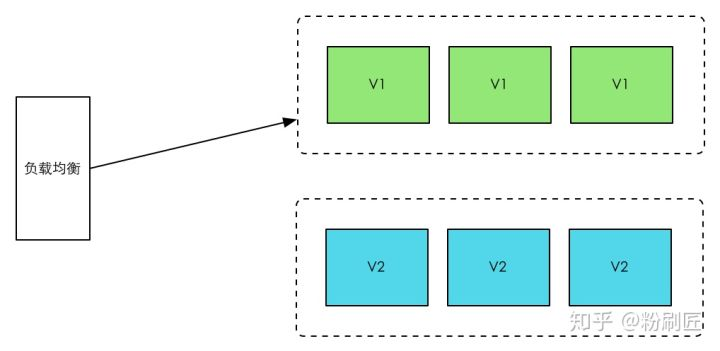
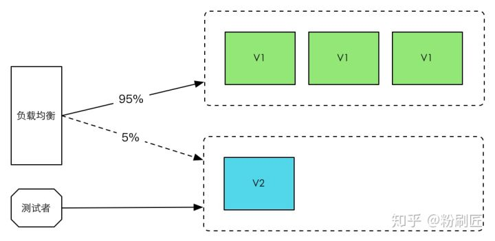

# Kong系列-07-负载均衡

Kong提供了两种负载均衡方案：

- 基于DNS的负载均衡

当使用基于DNS的负载均衡时，上游服务的注册是在Kong之外完成，而Kong只接收来自DNS服务器的负载均衡域名解析。使用包含主机名（而不是IP地址）URL定义的每个API将自动使用基于DNS的负载均衡。

- Ring-Balancer环形均衡器

使用环形均衡器时，上游服务的添加和删除将由Kong处理，不需要进行DNS域名解析（当然如果target配置为域名也需要解析域名，但不需要DNS实现负载均衡）。Kong将扮演服务注册中心的角色。使用upstream和target配置服务。

1. 加权循环算法：默认情况下环形均衡器将使用加权循环的方案。
1. 散列算法：以none、consumer、IP或者header为输入的散列算法。none就是加权循环算法。

负载均衡应用

- 蓝绿部署Blue-Green Deployments

可以通过通过定义蓝upstream和绿upstream。然后通过更新Kong Service，切换host对应的upstrean来达到蓝绿的快速切换。

- 金丝雀发布Canary Releases

直接使用环形均衡器，通过调整target的权重，允许一个平滑和可控的金丝雀环境。

下面验证一下Ring-Balancer环形均衡器。先创建两个echo服务，为了验证负载均衡，两个echo服务的名称定为echo-v1和echo-v2，其port分别为8080和8081。

    vi echo-v1-service.yaml
    apiVersion: v1
    kind: Service
    metadata:
      labels:
        app: echo-v1
      name: echo-v1
    spec:
      ports:
      - port: 8080
        name: http
        protocol: TCP
        targetPort: 8080
      selector:
        app: echo-v1
    ---
    apiVersion: apps/v1
    kind: Deployment
    metadata:
      labels:
        app: echo-v1
      name: echo-v1
    spec:
      replicas: 1
      selector:
        matchLabels:
          app: echo-v1
      strategy: {}
      template:
        metadata:
          creationTimestamp: null
          labels:
            app: echo-v1
        spec:
          containers:
          - image: e2eteam/echoserver:2.2
            name: echo-v1
            ports:
            - containerPort: 8080
            env:
              - name: NODE_NAME
                valueFrom:
                  fieldRef:
                    fieldPath: spec.nodeName
              - name: POD_NAME
                valueFrom:
                  fieldRef:
                    fieldPath: metadata.name
              - name: POD_NAMESPACE
                valueFrom:
                  fieldRef:
                    fieldPath: metadata.namespace
              - name: POD_IP
                valueFrom:
                  fieldRef:
                    fieldPath: status.podIP
            resources: {}
    
    vi echo-v2-service.yaml
    apiVersion: v1
    kind: Service
    metadata:
      labels:
        app: echo-v2
      name: echo-v2
    spec:
      ports:
      - port: 8081
        name: http
        protocol: TCP
        targetPort: 8080
      selector:
        app: echo-v2
    ---
    apiVersion: apps/v1
    kind: Deployment
    metadata:
      labels:
        app: echo-v2
      name: echo-v2
    spec:
      replicas: 1
      selector:
        matchLabels:
          app: echo-v2
      strategy: {}
      template:
        metadata:
          creationTimestamp: null
          labels:
            app: echo-v2
        spec:
          containers:
          - image: e2eteam/echoserver:2.2
            name: echo-v2
            ports:
            - containerPort: 8080
            env:
              - name: NODE_NAME
                valueFrom:
                  fieldRef:
                    fieldPath: spec.nodeName
              - name: POD_NAME
                valueFrom:
                  fieldRef:
                    fieldPath: metadata.name
              - name: POD_NAMESPACE
                valueFrom:
                  fieldRef:
                    fieldPath: metadata.namespace
              - name: POD_IP
                valueFrom:
                  fieldRef:
                    fieldPath: status.podIP
            resources: {}
    
    kubectl apply -f echo-v1-service.yaml
    kubectl apply -f echo-v2-service.yaml

创建一个upstream，名称为echo-upstream。

    curl -X POST \
      --url http://192.168.1.55:32444/upstreams \
      --data "name=echo-upstream" \
      -s | python -m json.tool
    {
        "algorithm": "round-robin",
        "created_at": 1577502909,
        "hash_fallback": "none",
        "hash_fallback_header": null,
        "hash_on": "none",
        "hash_on_cookie": null,
        "hash_on_cookie_path": "/",
        "hash_on_header": null,
        "healthchecks": {
            "active": {
                "concurrency": 10,
                "healthy": {
                    "http_statuses": [
                        200,
                        302
                    ],
                    "interval": 0,
                    "successes": 0
                },
                "http_path": "/",
                "https_sni": null,
                "https_verify_certificate": true,
                "timeout": 1,
                "type": "http",
                "unhealthy": {
                    "http_failures": 0,
                    "http_statuses": [
                        429,
                        404,
                        500,
                        501,
                        502,
                        503,
                        504,
                        505
                    ],
                    "interval": 0,
                    "tcp_failures": 0,
                    "timeouts": 0
                }
            },
            "passive": {
                "healthy": {
                    "http_statuses": [
                        200,
                        201,
                        202,
                        203,
                        204,
                        205,
                        206,
                        207,
                        208,
                        226,
                        300,
                        301,
                        302,
                        303,
                        304,
                        305,
                        306,
                        307,
                        308
                    ],
                    "successes": 0
                },
                "type": "http",
                "unhealthy": {
                    "http_failures": 0,
                    "http_statuses": [
                        429,
                        500,
                        503
                    ],
                    "tcp_failures": 0,
                    "timeouts": 0
                }
            }
        },
        "id": "d440cf4f-bf3a-4127-b610-4e811e5231c2",
        "name": "echo-upstream",
        "slots": 10000,
        "tags": null
    }

为echo-upstream上游服务创建两个负载均衡target，分别对应以上创建的两个kubernetes的echo-v1和echo-v2服务。注意两个target的权重，是150:50。

    curl -X POST \
      --url http://192.168.1.55:32444/upstreams/echo-upstream/targets \
      --data "target=echo-v1:8080" \
      --data "weight=150" \
      -s | python -m json.tool
    {
        "created_at": 1577503409.365,
        "id": "97f5c06a-a4a3-4734-ae3d-eac95a78f6f8",
        "target": "echo-v1:8080",
        "upstream": {
            "id": "d440cf4f-bf3a-4127-b610-4e811e5231c2"
        },
        "weight": 150
    }
    
    curl -X POST \
      --url http://192.168.1.55:32444/upstreams/echo-upstream/targets \
      --data "target=echo-v2:8081" \
      --data "weight=50" \
      -s | python -m json.tool
    {
        "created_at": 1577503417.043,
        "id": "e09063bf-634b-4dbb-a95d-71b5e9526cec",
        "target": "echo-v2:8081",
        "upstream": {
            "id": "d440cf4f-bf3a-4127-b610-4e811e5231c2"
        },
        "weight": 50
    }

创建service，其中host对应以上创建的echo-upstream。

    curl -X POST \
      --url http://192.168.1.55:32444/services/ \
      --data "name=echo-service" \
      --data "host=echo-upstream" \
      -s | python -m json.tool
    {
        "client_certificate": null,
        "connect_timeout": 60000,
        "created_at": 1577503779,
        "host": "echo-upstream",
        "id": "1f47b93c-b677-4990-9cbc-4504cbd89f6d",
        "name": "echo-service",
        "path": null,
        "port": 80,
        "protocol": "http",
        "read_timeout": 60000,
        "retries": 5,
        "tags": null,
        "updated_at": 1577503779,
        "write_timeout": 60000
    }

创建路由。

    curl -X POST \
      --url http://192.168.1.55:32444/services/echo-service/routes \
      --data 'name=echo-service-route' \
      --data "paths[]=/foo" \
      -s | python -m json.tool
    {
        "created_at": 1577503971,
        "destinations": null,
        "headers": null,
        "hosts": null,
        "https_redirect_status_code": 426,
        "id": "56861fa1-a605-4bb7-a7f9-3726ed41b762",
        "methods": null,
        "name": "echo-service-route",
        "paths": [
            "/foo"
        ],
        "preserve_host": false,
        "protocols": [
            "http",
            "https"
        ],
        "regex_priority": 0,
        "service": {
            "id": "1f47b93c-b677-4990-9cbc-4504cbd89f6d"
        },
        "snis": null,
        "sources": null,
        "strip_path": true,
        "tags": null,
        "updated_at": 1577503971
    }

测试一下效果。根据结果看echo-v1 : echo-v2基本上符合3 ： 1。

    curl -i http://192.168.1.55:32080/foo
    HTTP/1.1 200 OK
    Content-Type: text/plain; charset=UTF-8
    Transfer-Encoding: chunked
    Connection: keep-alive
    Date: Sat, 28 Dec 2019 03:34:33 GMT
    Server: echoserver
    X-Kong-Upstream-Latency: 44
    X-Kong-Proxy-Latency: 4
    Via: kong/1.3.0
    
    
    Hostname: echo-v1-7db89db86-5xvcw
    
    Pod Information:
            node name:      k8s-node2
            pod name:       echo-v1-7db89db86-5xvcw
            pod namespace:  default
            pod IP: 10.244.2.12
    
    Server values:
            server_version=nginx: 1.14.2 - lua: 10015
    
    Request Information:
            client_address=10.244.1.14
            method=GET
            real path=/
            query=
            request_version=1.1
            request_scheme=http
            request_uri=http://echo-v1:8080/
    
    Request Headers:
            accept=*/*
            connection=keep-alive
            host=echo-v1:8080
            user-agent=curl/7.29.0
            x-forwarded-for=10.244.0.0
            x-forwarded-host=192.168.1.55
            x-forwarded-port=8000
            x-forwarded-proto=http
            x-real-ip=10.244.0.0
    
    Request Body:
            -no body in request-
    
    curl -i http://192.168.1.55:32080/foo -s | grep "pod name:"
            pod name:       echo-v1-7db89db86-5xvcw
    curl -i http://192.168.1.55:32080/foo -s | grep "pod name:"
            pod name:       echo-v1-7db89db86-5xvcw
    curl -i http://192.168.1.55:32080/foo -s | grep "pod name:"
            pod name:       echo-v1-7db89db86-5xvcw
    curl -i http://192.168.1.55:32080/foo -s | grep "pod name:"
            pod name:       echo-v1-7db89db86-5xvcw
    curl -i http://192.168.1.55:32080/foo -s | grep "pod name:"
            pod name:       echo-v2-644b65df68-css5k
    curl -i http://192.168.1.55:32080/foo -s | grep "pod name:"
            pod name:       echo-v2-644b65df68-css5k
    curl -i http://192.168.1.55:32080/foo -s | grep "pod name:"
            pod name:       echo-v2-644b65df68-css5k
    curl -i http://192.168.1.55:32080/foo -s | grep "pod name:"
            pod name:       echo-v2-644b65df68-css5k
    curl -i http://192.168.1.55:32080/foo -s | grep "pod name:"
            pod name:       echo-v1-7db89db86-5xvcw
    curl -i http://192.168.1.55:32080/foo -s | grep "pod name:"
            pod name:       echo-v2-644b65df68-css5k
    curl -i http://192.168.1.55:32080/foo -s | grep "pod name:"
            pod name:       echo-v1-7db89db86-5xvcw
    curl -i http://192.168.1.55:32080/foo -s | grep "pod name:"
            pod name:       echo-v1-7db89db86-5xvcw
    curl -i http://192.168.1.55:32080/foo -s | grep "pod name:"
            pod name:       echo-v1-7db89db86-5xvcw
    curl -i http://192.168.1.55:32080/foo -s | grep "pod name:"
            pod name:       echo-v1-7db89db86-5xvcw
    curl -i http://192.168.1.55:32080/foo -s | grep "pod name:"
            pod name:       echo-v2-644b65df68-css5k
    curl -i http://192.168.1.55:32080/foo -s | grep "pod name:"
            pod name:       echo-v1-7db89db86-5xvcw
    curl -i http://192.168.1.55:32080/foo -s | grep "pod name:"
            pod name:       echo-v1-7db89db86-5xvcw
    curl -i http://192.168.1.55:32080/foo -s | grep "pod name:"
            pod name:       echo-v1-7db89db86-5xvcw
    curl -i http://192.168.1.55:32080/foo -s | grep "pod name:"
            pod name:       echo-v1-7db89db86-5xvcw
    curl -i http://192.168.1.55:32080/foo -s | grep "pod name:"
            pod name:       echo-v1-7db89db86-5xvcw
    curl -i http://192.168.1.55:32080/foo -s | grep "pod name:"
            pod name:       echo-v1-7db89db86-5xvcw
    curl -i http://192.168.1.55:32080/foo -s | grep "pod name:"
            pod name:       echo-v1-7db89db86-5xvcw
    curl -i http://192.168.1.55:32080/foo -s | grep "pod name:"
            pod name:       echo-v1-7db89db86-5xvcw