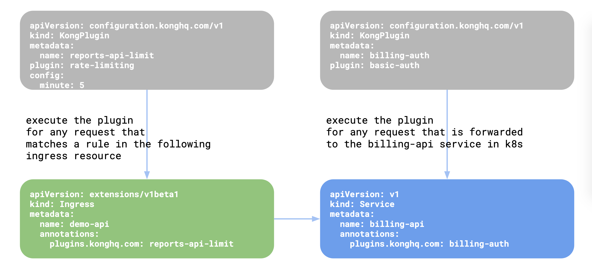
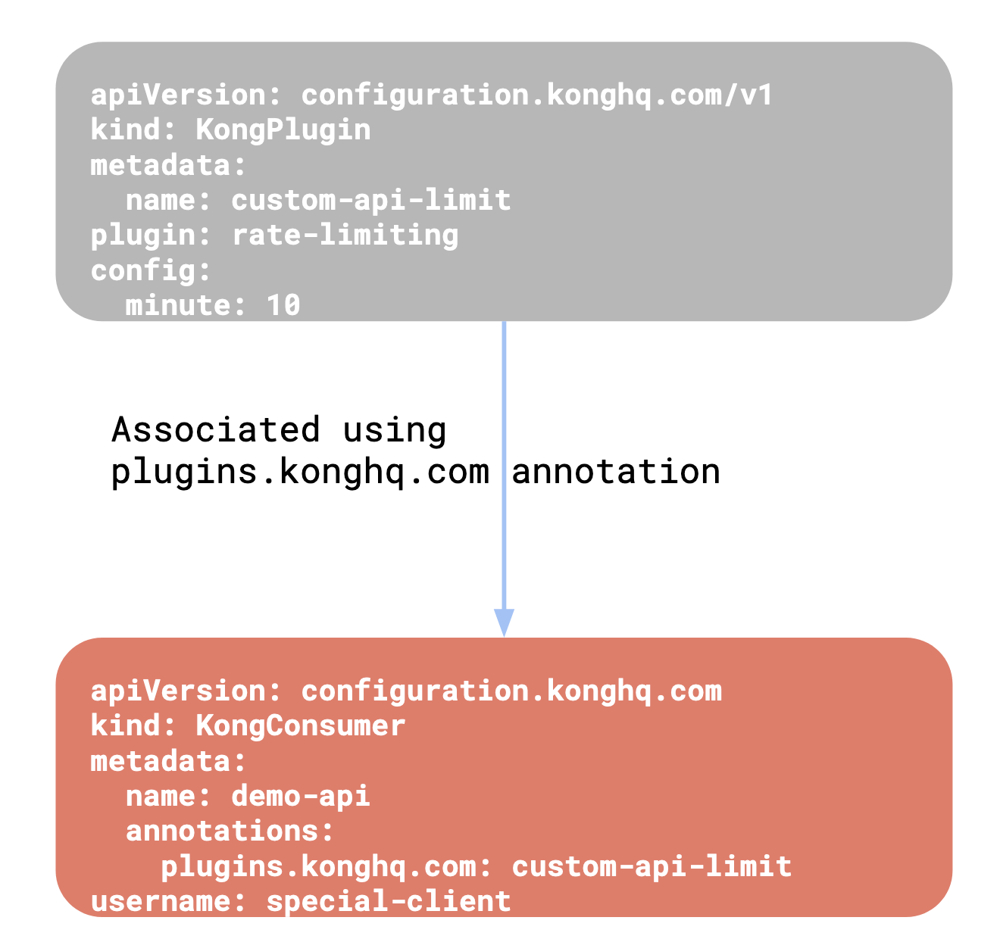

# Kong系列-10-KongPlugin介绍

KongPlugin资源的定义：

    apiVersion: configuration.konghq.com/v1
    kind: KongPlugin
    metadata:
      name: <名称>
      namespace: <命名空间>
      labels:
        global: "true"   #可选，如果设置，该插件为全局插件，应该使用双引号将true引起来
    disabled: <boolean>  #可选，将该插件禁用
    config:              #该插件的配置，插件的说明文档中能够查到响应的配置
        key: value
    plugin: <插件名称>    #如key-auth，rate-limiting等

创建KongPlugin资源后，还需要将该资源与Kubernetes中的Ingress、Service或KongConsumer资源关联。下图显示了KongPlugin资源和Ingress、Service和KongConsumer的关联关系。

|  |  |
:-:|:-:
|

下面介绍一下如何使用KongPlugin资源。先将Kong初始化为空配置。

    curl -i http://192.168.1.55:32080/
    HTTP/1.1 404 Not Found
    Date: Tue, 24 Dec 2019 12:18:34 GMT
    Content-Type: application/json; charset=utf-8
    Connection: keep-alive
    Content-Length: 48
    Server: kong/1.3.0
    
    {"message":"no Route matched with those values"}

创建一个echo服务和httpbin服务。

    vi echo-service.yaml
    ---
    apiVersion: v1
    kind: Service
    metadata:
      labels:
        app: echo
      name: echo
    spec:
      ports:
      - name: http
        port: 8080
        protocol: TCP
        targetPort: 8080
      selector:
        app: echo
    ---
    apiVersion: apps/v1
    kind: Deployment
    metadata:
      labels:
        app: echo
      name: echo
    spec:
      replicas: 1
      selector:
        matchLabels:
          app: echo
      strategy: {}
      template:
        metadata:
          creationTimestamp: null
          labels:
            app: echo
        spec:
          containers:
          - image: e2eteam/echoserver:2.2
            name: echo
            ports:
            - containerPort: 8080
            env:
              - name: NODE_NAME
                valueFrom:
                  fieldRef:
                    fieldPath: spec.nodeName
              - name: POD_NAME
                valueFrom:
                  fieldRef:
                    fieldPath: metadata.name
              - name: POD_NAMESPACE
                valueFrom:
                  fieldRef:
                    fieldPath: metadata.namespace
              - name: POD_IP
                valueFrom:
                  fieldRef:
                    fieldPath: status.podIP
            resources: {}
    
    vi httpbin-service.yaml
    ---
    apiVersion: v1
    kind: Service
    metadata:
      name: httpbin
      labels:
        app: httpbin
    spec:
      ports:
      - name: http
        port: 80
        targetPort: 80
      selector:
        app: httpbin
    ---
    apiVersion: apps/v1
    kind: Deployment
    metadata:
      name: httpbin
    spec:
      replicas: 1
      selector:
        matchLabels:
          app: httpbin
      template:
        metadata:
          labels:
            app: httpbin
        spec:
          containers:
          - image: docker.io/kennethreitz/httpbin
            name: httpbin
            ports:
            - containerPort: 80
    
    kubectl apply -f echo-service.yaml
    kubectl apply -f httpbin-service.yaml

我们先测试一下插件应用于Ingress。先创建Ingress，分别对应两个服务。

    vi httpbin-echo-ingress.yaml
    ---
    apiVersion: extensions/v1beta1
    kind: Ingress
    metadata:
      name: httpbin-echo-ingress
    spec:
      rules:
      - http:
          paths:
          - path: /foo
            backend:
              serviceName: httpbin
              servicePort: 80
          - path: /bar
            backend:
              serviceName: echo
              servicePort: 80    

    kubectl apply -f httpbin-echo-ingress.yaml

测试一下，两个服务都能访问。

    curl -i http://192.168.1.55:32080/foo/status/200
    HTTP/1.1 200 OK
    Content-Type: text/html; charset=utf-8
    Content-Length: 0
    Connection: keep-alive
    Server: gunicorn/19.9.0
    Date: Tue, 24 Dec 2019 12:30:04 GMT
    Access-Control-Allow-Origin: *
    Access-Control-Allow-Credentials: true
    X-Kong-Upstream-Latency: 13
    X-Kong-Proxy-Latency: 13
    Via: kong/1.3.0
    
    curl -i http://192.168.1.55:32080/bar
    HTTP/1.1 200 OK
    Content-Type: text/plain; charset=UTF-8
    Transfer-Encoding: chunked
    Connection: keep-alive
    Date: Tue, 24 Dec 2019 12:30:57 GMT
    Server: echoserver
    X-Kong-Upstream-Latency: 8
    X-Kong-Proxy-Latency: 3
    Via: kong/1.3.0
    
    
    Hostname: echo-75cf96d976-868pp
    
    Pod Information:
            node name:      k8s-node2
            pod name:       echo-75cf96d976-868pp
            pod namespace:  default
            pod IP: 10.244.2.27
    
    Server values:
            server_version=nginx: 1.14.2 - lua: 10015
    
    Request Information:
            client_address=10.244.1.24
            method=GET
            real path=/
            query=
            request_version=1.1
            request_scheme=http
            request_uri=http://192.168.1.55:8080/
    
    Request Headers:
            accept=*/*
            connection=keep-alive
            host=192.168.1.55:32080
            user-agent=curl/7.29.0
            x-forwarded-for=10.244.0.0
            x-forwarded-host=192.168.1.55
            x-forwarded-port=8000
            x-forwarded-proto=http
            x-real-ip=10.244.0.0
    
    Request Body:
            -no body in request-

为httpbin服务另外在创建一个Ingress。

    vi httpbin-ingress.yaml
    ---
    apiVersion: extensions/v1beta1
    kind: Ingress
    metadata:
      name: httpbin-ingress
    spec:
      rules:
      - http:
          paths:
          - path: /baz
            backend:
              serviceName: httpbin
              servicePort: 80    

    kubectl apply -f httpbin-ingress.yaml

测试一下。

    curl -i http://192.168.1.55:32080/baz/status/200
    HTTP/1.1 200 OK
    Content-Type: text/html; charset=utf-8
    Content-Length: 0
    Connection: keep-alive
    Server: gunicorn/19.9.0
    Date: Sat, 18 Jan 2020 11:56:01 GMT
    Access-Control-Allow-Origin: *
    Access-Control-Allow-Credentials: true
    X-Kong-Upstream-Latency: 10
    X-Kong-Proxy-Latency: 6
    Via: kong/1.3.0

创建Response Transformer插件，该插件能在响应报文中对header或者json body进行转换，此例中增加响应头“demo:injected-by-kong”。

    vi response-transformer-plugin.yaml
    ---
    apiVersion: configuration.konghq.com/v1
    kind: KongPlugin
    metadata:
      name: add-response-header
    config:
      add:
        headers:
        - "demo:injected-by-kong"
    plugin: response-transformer
    
    kubectl apply -f response-transformer-plugin.yaml

将该插件应用到Ingress中。

    kubectl patch ingress httpbin-echo-ingress -p '{"metadata":{"annotations":{"plugins.konghq.com":"add-response-header"}}}'

分别测试一下/foo、/bar和/baz三个路径，可以看出插件只在httpbin-echo-ingress启用了。

    curl -i http://192.168.1.55:32080/foo/status/200
    HTTP/1.1 200 OK
    Content-Type: text/html; charset=utf-8
    Content-Length: 0
    Connection: keep-alive
    Server: gunicorn/19.9.0
    Date: Tue, 24 Dec 2019 12:43:17 GMT
    Access-Control-Allow-Origin: *
    Access-Control-Allow-Credentials: true
    demo:  injected-by-kong
    X-Kong-Upstream-Latency: 11
    X-Kong-Proxy-Latency: 34
    Via: kong/1.3.0
    
    curl -i http://192.168.1.55:32080/bar
    HTTP/1.1 200 OK
    Content-Type: text/plain; charset=UTF-8
    Transfer-Encoding: chunked
    Connection: keep-alive
    Date: Tue, 24 Dec 2019 12:43:58 GMT
    Server: echoserver
    demo:  injected-by-kong
    X-Kong-Upstream-Latency: 62
    X-Kong-Proxy-Latency: 49
    Via: kong/1.3.0
    
    
    Hostname: echo-75cf96d976-fg56m
    
    Pod Information:
            node name:      k8s-node1
            pod name:       echo-75cf96d976-fg56m
            pod namespace:  default
            pod IP: 10.244.1.25
    
    Server values:
            server_version=nginx: 1.14.2 - lua: 10015
    
    Request Information:
            client_address=10.244.2.24
            method=GET
            real path=/
            query=
            request_version=1.1
            request_scheme=http
            request_uri=http://192.168.1.55:8080/
    
    Request Headers:
            accept=*/*
            connection=keep-alive
            host=192.168.1.55:32080
            user-agent=curl/7.29.0
            x-forwarded-for=10.244.0.0
            x-forwarded-host=192.168.1.55
            x-forwarded-port=8000
            x-forwarded-proto=http
            x-real-ip=10.244.0.0
    
    Request Body:
            -no body in request-
    
    curl -I http://192.168.1.55:32080/baz/status/200
    HTTP/1.1 200 OK
    Content-Type: text/html; charset=utf-8
    Content-Length: 9593
    Connection: keep-alive
    Server: gunicorn/19.9.0
    Date: Tue, 24 Dec 2019 12:44:50 GMT
    Access-Control-Allow-Origin: *
    Access-Control-Allow-Credentials: true
    X-Kong-Upstream-Latency: 118
    X-Kong-Proxy-Latency: 20
    Via: kong/1.3.0

再测试一下插件应用于Service。先创建Key Authentication插件，此插件会验证请求的ApiKey。

    vi key-auth-plugin.yaml
    ---
    apiVersion: configuration.konghq.com/v1
    kind: KongPlugin
    metadata:
      name: httpbin-auth
    plugin: key-auth
    
    kubectl apply -f key-auth-plugin.yaml

将插件应用于httpbin服务。

    kubectl patch service httpbin -p '{"metadata":{"annotations":{"plugins.konghq.com":"httpbin-auth"}}}'

测试一下，对httpbin服务访问的两个路径都需要认证，可以看出该插件确实应用于httpbin服务了。对echo服务的访问不需要认证，没有启用该插件。

    curl -I http://192.168.1.55:32080/baz/status/200
    HTTP/1.1 401 Unauthorized
    Date: Sat, 18 Jan 2020 12:28:52 GMT
    Content-Type: application/json; charset=utf-8
    Connection: keep-alive
    WWW-Authenticate: Key realm="kong"
    Content-Length: 41
    Server: kong/1.3.0
    
    curl -i http://192.168.1.55:32080/foo/status/200
    HTTP/1.1 401 Unauthorized
    Date: Sat, 18 Jan 2020 12:28:56 GMT
    Content-Type: application/json; charset=utf-8
    Connection: keep-alive
    WWW-Authenticate: Key realm="kong"
    Content-Length: 41
    demo: injected-by-kong
    Server: kong/1.3.0
    
    curl -i http://192.168.1.55:32080/bar
    HTTP/1.1 200 OK
    Content-Type: text/plain; charset=UTF-8
    Transfer-Encoding: chunked
    Connection: keep-alive
    Date: Sat, 18 Jan 2020 12:29:19 GMT
    Server: echoserver
    demo: injected-by-kong
    X-Kong-Upstream-Latency: 3
    X-Kong-Proxy-Latency: 47
    Via: kong/1.3.0
    
    
    Hostname: echo-75cf96d976-vg5rz
    
    Pod Information:
            node name:      k8s-node2
            pod name:       echo-75cf96d976-vg5rz
            pod namespace:  default
            pod IP: 10.244.2.13
    
    Server values:
            server_version=nginx: 1.14.2 - lua: 10015
    
    Request Information:
            client_address=10.244.2.10
            method=GET
            real path=/
            query=
            request_version=1.1
            request_scheme=http
            request_uri=http://192.168.1.55:8080/
    
    Request Headers:
            accept=*/*
            connection=keep-alive
            host=192.168.1.55:32080
            user-agent=curl/7.29.0
            x-forwarded-for=10.244.0.0
            x-forwarded-host=192.168.1.55
            x-forwarded-port=8000
            x-forwarded-proto=http
            x-real-ip=10.244.0.0
    
    Request Body:
            -no body in request-

为Key Authentication插件创建KongConsumer和KongCredential。

    vi twingao-consumer.yaml
    ---
    apiVersion: configuration.konghq.com/v1
    kind: KongConsumer
    metadata:
      name: twingao-consumer
    username: twingao

    vi twingao-apikey-credential.yaml
    ---
    apiVersion: configuration.konghq.com/v1
    kind: KongCredential
    metadata:
      name: twingao-apikey-credential
    consumerRef: twingao-consumer
    type: key-auth
    config:
      key: hello-api
    
    kubectl apply -f twingao-consumer.yaml
    kubectl apply -f twingao-apikey.yaml

测试一下，在请求中携带请求头“apikey: hello-api”，可以访问。

    curl -I http://192.168.1.55:32080/baz/status/200 -H 'apikey: hello-api'
    HTTP/1.1 200 OK
    Content-Type: text/html; charset=utf-8
    Content-Length: 9593
    Connection: keep-alive
    Server: gunicorn/19.9.0
    Date: Tue, 24 Dec 2019 13:34:21 GMT
    Access-Control-Allow-Origin: *
    Access-Control-Allow-Credentials: true
    X-Kong-Upstream-Latency: 42
    X-Kong-Proxy-Latency: 50
    Via: kong/1.3.0
    
    curl -I http://192.168.1.55:32080/foo/status/200 -H 'apikey: hello-api'
    HTTP/1.1 200 OK
    Content-Type: text/html; charset=utf-8
    Content-Length: 9593
    Connection: keep-alive
    Server: gunicorn/19.9.0
    Date: Tue, 24 Dec 2019 13:35:08 GMT
    Access-Control-Allow-Origin: *
    Access-Control-Allow-Credentials: true
    demo: injected-by-kong
    X-Kong-Upstream-Latency: 23
    X-Kong-Proxy-Latency: 3
    Via: kong/1.3.0

再测试一下全局应用插件，先创建Rate Limiting插件。

    vi rate-limiting-plugin.yaml
    ---
    apiVersion: configuration.konghq.com/v1
    kind: KongPlugin
    metadata:
      name: global-rate-limiting
      labels:
        global: "true"
    config:
      minute: 5
      limit_by: consumer
      policy: local
    plugin: rate-limiting    

    kubectl apply -f rate-limiting-plugin.yaml

测试一下/foo、/bar和/baz三个路径，从响应头可以看出限速插件确实应用全局了。

    curl -I http://192.168.1.55:32080/foo/status/200 -H 'apikey: hello-api'
    HTTP/1.1 200 OK
    Content-Type: text/html; charset=utf-8
    Content-Length: 0
    Connection: keep-alive
    Server: gunicorn/19.9.0
    Date: Sat, 18 Jan 2020 14:06:55 GMT
    Access-Control-Allow-Origin: *
    Access-Control-Allow-Credentials: true
    X-RateLimit-Limit-minute: 5
    X-RateLimit-Remaining-minute: 4
    demo: injected-by-kong
    X-Kong-Upstream-Latency: 13
    X-Kong-Proxy-Latency: 20
    Via: kong/1.3.0
    
    curl -I http://192.168.1.55:32080/bar
    HTTP/1.1 200 OK
    Content-Type: text/plain; charset=UTF-8
    Connection: keep-alive
    Date: Sat, 18 Jan 2020 14:09:21 GMT
    Server: echoserver
    X-RateLimit-Limit-minute: 5
    X-RateLimit-Remaining-minute: 1
    demo: injected-by-kong
    X-Kong-Upstream-Latency: 2
    X-Kong-Proxy-Latency: 3
    Via: kong/1.3.0
    
    curl -I http://192.168.1.55:32080/baz/status/200 -H 'apikey: hello-api'
    HTTP/1.1 200 OK
    Content-Type: text/html; charset=utf-8
    Content-Length: 0
    Connection: keep-alive
    Server: gunicorn/19.9.0
    Date: Sat, 18 Jan 2020 14:10:37 GMT
    Access-Control-Allow-Origin: *
    Access-Control-Allow-Credentials: true
    X-RateLimit-Limit-minute: 5
    X-RateLimit-Remaining-minute: 4
    X-Kong-Upstream-Latency: 7
    X-Kong-Proxy-Latency: 23
    Via: kong/1.3.0

最后测试一下插件应用于Consumer，先创建Rate Limiting插件。注意此例为10次/分钟。

    vi rate-limiting-plugin-2.yaml
    ---
    apiVersion: configuration.konghq.com/v1
    kind: KongPlugin
    metadata:
      name: rate-limiting-2
    config:
      minute: 10
      limit_by: consumer
      policy: local
    plugin: rate-limiting
    
    kubectl apply -f rate-limiting-plugin-2.yaml

在KongConsumer中注解应用限速插件rate-limiting-2。

    vi twingao-consumer-2.yaml
    ---
    apiVersion: configuration.konghq.com/v1
    kind: KongConsumer
    metadata:
      name: twingao-consumer
      annotations:
        plugins.konghq.com: rate-limiting-2
    username: twingao
    
    kubectl apply -f twingao-consumer-2.yaml

测试一下，携带请求头“apikey: hello-api”访问/foo路径，该请求对应twingao-consumer消费者，从响应头“X-RateLimit-Limit-minute: 10”为10可以看出应用了限速插件rate-limiting-2。而/bar仍然是原来的限速插件。

    curl -I http://192.168.1.55:32080/foo/status/200 -H 'apikey: hello-api'
    HTTP/1.1 200 OK
    Content-Type: text/html; charset=utf-8
    Content-Length: 0
    Connection: keep-alive
    Server: gunicorn/19.9.0
    Date: Sat, 18 Jan 2020 14:27:33 GMT
    Access-Control-Allow-Origin: *
    Access-Control-Allow-Credentials: true
    X-RateLimit-Limit-minute: 10
    X-RateLimit-Remaining-minute: 9
    demo: injected-by-kong
    X-Kong-Upstream-Latency: 14
    X-Kong-Proxy-Latency: 16
    Via: kong/1.3.0
    
    curl -I http://192.168.1.55:32080/bar
    HTTP/1.1 200 OK
    Content-Type: text/plain; charset=UTF-8
    Connection: keep-alive
    Date: Sat, 18 Jan 2020 14:28:20 GMT
    Server: echoserver
    X-RateLimit-Limit-minute: 5
    X-RateLimit-Remaining-minute: 4
    demo: injected-by-kong
    X-Kong-Upstream-Latency: 5
    X-Kong-Proxy-Latency: 11
    Via: kong/1.3.0