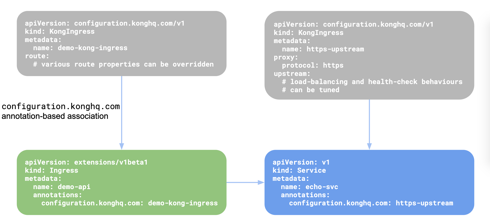

# Kong系列-11-KongIngress介绍

Kubernetes的Ingress资源基于HTTP报文头和路径定义路由策略。在大多数情况下这已足够，但有时希望在Ingress级别对路由进行更多控制，通用的Ingress资源无法满足需求，所以Kong提供KongIngress CRD对Ingress资源进行了扩展，以提供对代理行为更细粒度控制，KongIngress与Ingress资源协同工作并对其进行扩展。它并不是在Kubernetes中替代Ingress资源。使用KongIngress可以修改Kong中与Ingress资源相关的Upstream，Service和Route实体的所有属性。

KongIngress资源的定义：

    apiVersion: configuration.konghq.com/v1
    kind: KongIngress
    metadata:
      name: configuration-demo
    upstream:
      hash_on: none
      hash_fallback: none
      healthchecks:
        active:
          concurrency: 10
          healthy:
            http_statuses:
            - 200
            - 302
            interval: 0
            successes: 0
          http_path: "/"
          timeout: 1
          unhealthy:
            http_failures: 0
            http_statuses:
            - 429
            interval: 0
            tcp_failures: 0
            timeouts: 0
        passive:
          healthy:
            http_statuses:
            - 200
            successes: 0
          unhealthy:
            http_failures: 0
            http_statuses:
            - 429
            - 503
            tcp_failures: 0
            timeouts: 0
        slots: 10
    proxy:
      protocol: http
      path: /
      connect_timeout: 10000
      retries: 10
      read_timeout: 10000
      write_timeout: 10000
    route:
      methods:
      - POST
      - GET
      regex_priority: 0
      strip_path: false
      preserve_host: true
      protocols:
      - http
      - https

创建KongIngress资源后，可以使用configuration.konghq.com声明将KongIngress资源与Ingress或Service资源关联：

- 将声明添加到Ingress资源后，路由配置将更新，这意味着与带声明的Ingress关联的所有路由都将更新为使用KongIngress的route部分中定义的值。
- 将声明添加到Kubernetes中的Service资源时，Kong中的相应Service和Upstream将更新为使用关联的KongIngress资源中定义的proxy和upstream部分中定义的值。

下面介绍一下如何使用KongPlugin资源，先将Kong初始化为空配置。

    curl -i http://192.168.1.55:32080
    HTTP/1.1 404 Not Found
    Date: Tue, 24 Dec 2019 14:03:40 GMT
    Content-Type: application/json; charset=utf-8
    Connection: keep-alive
    Content-Length: 48
    Server: kong/1.3.0
    
    {"message":"no Route matched with those values"}

创建一个echo服务。

    vi echo-service.yaml
    ---
    apiVersion: v1
    kind: Service
    metadata:
      labels:
        app: echo
      name: echo
    spec:
      ports:
      - name: http
        port: 8080
        protocol: TCP
        targetPort: 8080
      selector:
        app: echo
    ---
    apiVersion: apps/v1
    kind: Deployment
    metadata:
      labels:
        app: echo
      name: echo
    spec:
      replicas: 2
      selector:
        matchLabels:
          app: echo
      strategy: {}
      template:
        metadata:
          creationTimestamp: null
          labels:
            app: echo
        spec:
          containers:
          - image: e2eteam/echoserver:2.2
            name: echo
            ports:
            - containerPort: 8080
            env:
              - name: NODE_NAME
                valueFrom:
                  fieldRef:
                    fieldPath: spec.nodeName
              - name: POD_NAME
                valueFrom:
                  fieldRef:
                    fieldPath: metadata.name
              - name: POD_NAMESPACE
                valueFrom:
                  fieldRef:
                    fieldPath: metadata.namespace
              - name: POD_IP
                valueFrom:
                  fieldRef:
                    fieldPath: status.podIP
            resources: {}
    
    kubectl apply -f echo-service.yaml

创建对应的Ingress。

    vi echo-ingress.yaml
    ---
    apiVersion: extensions/v1beta1
    kind: Ingress
    metadata:
      name: echo-ingress
    spec:
      rules:
      - http:
          paths:
          - path: /foo
            backend:
              serviceName: echo
              servicePort: 80
    
    kubectl apply -f echo-ingress.yaml

测试一下，可以访问。注意请求中的路径前缀在真正发送给echo服务时，从“real path=/”可以看出会将路径前缀删除strip掉。

    curl -i http://192.168.1.55:32080/foo
    HTTP/1.1 200 OK
    Content-Type: text/plain; charset=UTF-8
    Transfer-Encoding: chunked
    Connection: keep-alive
    Date: Mon, 20 Jan 2020 12:51:17 GMT
    Server: echoserver
    X-Kong-Upstream-Latency: 8
    X-Kong-Proxy-Latency: 27
    Via: kong/1.3.0
    
    
    Hostname: echo-75cf96d976-4vrgl
    
    Pod Information:
            node name:      k8s-node1
            pod name:       echo-75cf96d976-4vrgl
            pod namespace:  default
            pod IP: 10.244.1.16
    
    Server values:
            server_version=nginx: 1.14.2 - lua: 10015
    
    Request Information:
            client_address=10.244.1.13
            method=GET
            real path=/
            query=
            request_version=1.1
            request_scheme=http
            request_uri=http://192.168.1.55:8080/
    
    Request Headers:
            accept=*/*
            connection=keep-alive
            host=192.168.1.55:32080
            user-agent=curl/7.29.0
            x-forwarded-for=10.244.0.0
            x-forwarded-host=192.168.1.55
            x-forwarded-port=8000
            x-forwarded-proto=http
            x-real-ip=10.244.0.0
    
    Request Body:
            -no body in request-

echo服务也支持POST请求。

    curl -I -X POST http://192.168.1.55:32080/foo
    HTTP/1.1 200 OK
    Content-Type: text/plain; charset=UTF-8
    Transfer-Encoding: chunked
    Connection: keep-alive
    Date: Mon, 20 Jan 2020 13:09:54 GMT
    Server: echoserver
    X-Kong-Upstream-Latency: 2
    X-Kong-Proxy-Latency: 3
    Via: kong/1.3.0

先测试一下将KongIngress应用到Ingress资源。我们尝试将请求转发给echo服务不要将路径前缀strip掉，并且只允许GET请求。我们可以使用KongIngress来改变Ingress的规则。先创建KongIngress资源，注意route部分的定义。

    vi echo-kongingress.yaml
    ---
    apiVersion: configuration.konghq.com/v1
    kind: KongIngress
    metadata:
      name: echo-kongingress
    route:
      methods:
      - GET
      strip_path: false
    
    kubectl apply -f echo-kongingress.yaml

将该KongIngress应用到Ingress资源上。

    kubectl patch ingress echo-ingress -p '{"metadata":{"annotations":{"configuration.konghq.com":"echo-kongingress"}}}'

测试一下，可以看到“real path=/foo”，不再strip掉路径前缀；也不允许POST请求。

    curl -i http://192.168.1.55:32080/foo
    HTTP/1.1 200 OK
    Content-Type: text/plain; charset=UTF-8
    Transfer-Encoding: chunked
    Connection: keep-alive
    Date: Mon, 20 Jan 2020 13:25:18 GMT
    Server: echoserver
    X-Kong-Upstream-Latency: 8
    X-Kong-Proxy-Latency: 83
    Via: kong/1.3.0
    
    
    Hostname: echo-75cf96d976-tc5bl
    
    Pod Information:
            node name:      k8s-node2
            pod name:       echo-75cf96d976-tc5bl
            pod namespace:  default
            pod IP: 10.244.2.17
    
    Server values:
            server_version=nginx: 1.14.2 - lua: 10015
    
    Request Information:
            client_address=10.244.2.10
            method=GET
            real path=/foo
            query=
            request_version=1.1
            request_scheme=http
            request_uri=http://192.168.1.55:8080/foo
    
    Request Headers:
            accept=*/*
            connection=keep-alive
            host=192.168.1.55:32080
            user-agent=curl/7.29.0
            x-forwarded-for=10.244.0.0
            x-forwarded-host=192.168.1.55
            x-forwarded-port=8000
            x-forwarded-proto=http
            x-real-ip=10.244.0.0
    
    Request Body:
            -no body in request-
    
    curl -I -X POST http://192.168.1.55:32080/foo
    HTTP/1.1 404 Not Found
    Date: Mon, 20 Jan 2020 13:25:48 GMT
    Content-Type: application/json; charset=utf-8
    Connection: keep-alive
    Content-Length: 48
    Server: kong/1.3.0

再测试一下将KongIngress应用到Service资源。KongIngress可用于更改Kong中的load-balancing、health-checking和其它代理行为。我们演示两个配置：根据客户端的IP地址对请求进行哈希处理；将/foo上的所有请求代理到/bar。

    vi echo-kongingress-2.yaml
    ---
    apiVersion: configuration.konghq.com/v1
    kind: KongIngress
    metadata:
      name: echo-kongingress-2
    upstream:
      hash_on: ip
    proxy:
      path: /bar/
    
    kubectl apply -f echo-kongingress-2.yaml

将KongIngress应用到Service资源上。

    kubectl patch service echo -p '{"metadata":{"annotations":{"configuration.konghq.com":"echo-kongingress-2"}}}'

从“real path=/bar/foo”可以看出，请求/foo会转发到/bar/foo上。

    curl -i http://192.168.1.55:32080/foo
    HTTP/1.1 200 OK
    Content-Type: text/plain; charset=UTF-8
    Transfer-Encoding: chunked
    Connection: keep-alive
    Date: Mon, 20 Jan 2020 13:42:32 GMT
    Server: echoserver
    X-Kong-Upstream-Latency: 10
    X-Kong-Proxy-Latency: 8
    Via: kong/1.3.0
    
    
    Hostname: echo-75cf96d976-tc5bl
    
    Pod Information:
            node name:      k8s-node2
            pod name:       echo-75cf96d976-tc5bl
            pod namespace:  default
            pod IP: 10.244.2.17
    
    Server values:
            server_version=nginx: 1.14.2 - lua: 10015
    
    Request Information:
            client_address=10.244.1.13
            method=GET
            real path=/bar/foo
            query=
            request_version=1.1
            request_scheme=http
            request_uri=http://192.168.1.55:8080/bar/foo
    
    Request Headers:
            accept=*/*
            connection=keep-alive
            host=192.168.1.55:32080
            user-agent=curl/7.29.0
            x-forwarded-for=10.244.0.0
            x-forwarded-host=192.168.1.55
            x-forwarded-port=8000
            x-forwarded-proto=http
            x-real-ip=10.244.0.0
    
    Request Body:
            -no body in request-

echo服务后端有两个Pod，通常请求会被负载均衡到两个Pod上。根据源IP地址hash，由于测试的源IP地址不变，所以所有请求都转发到同一个Pod。

    curl -s http://192.168.1.55:32080/foo | grep "pod IP"
            pod IP: 10.244.2.17
    curl -s http://192.168.1.55:32080/foo | grep "pod IP"
            pod IP: 10.244.2.17
    curl -s http://192.168.1.55:32080/foo | grep "pod IP"
            pod IP: 10.244.2.17
    curl -s http://192.168.1.55:32080/foo | grep "pod IP"
            pod IP: 10.244.2.17
    curl -s http://192.168.1.55:32080/foo | grep "pod IP"
            pod IP: 10.244.2.17
    curl -s http://192.168.1.55:32080/foo | grep "pod IP"
            pod IP: 10.244.2.17
    curl -s http://192.168.1.55:32080/foo | grep "pod IP"
            pod IP: 10.244.2.17
    curl -s http://192.168.1.55:32080/foo | grep "pod IP"
            pod IP: 10.244.2.17
    curl -s http://192.168.1.55:32080/foo | grep "pod IP"
            pod IP: 10.244.2.17
    curl -s http://192.168.1.55:32080/foo | grep "pod IP"
            pod IP: 10.244.2.17
    curl -s http://192.168.1.55:32080/foo | grep "pod IP"
            pod IP: 10.244.2.17