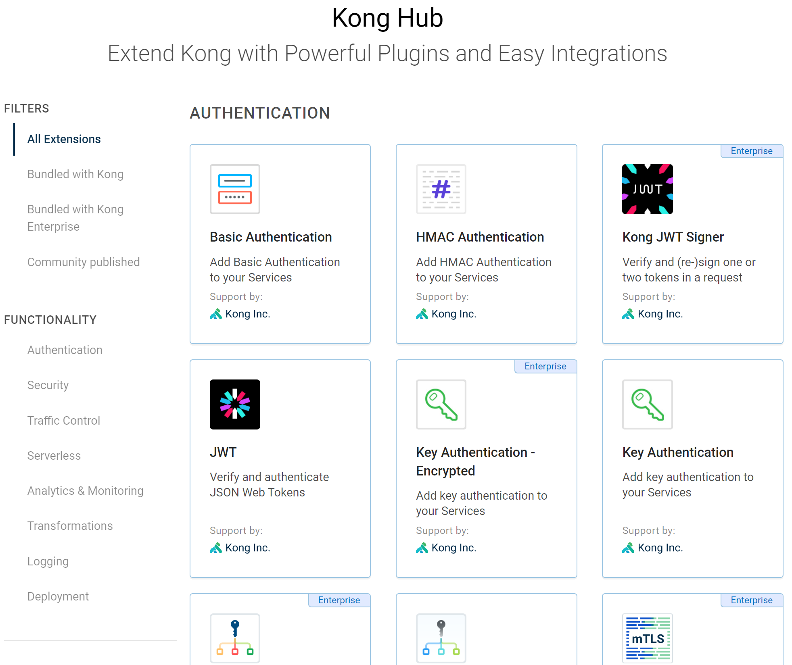

# Kong系列-13-官方开源插件介绍

Kong官方预置大量的插件，可以在Kong Hub查看官方插件，其中有三类插件，官方开发的开源插件；第三方开发的开源插件；适用于Kong Enterprise的收费插件。其中官方开发的开源插件有35个。

Kong安装完成后已经预置了开源插件的代码，可以在/usr/local/share/lua/5.1/kong/plugins目录查看。也可以在Kong的github代码库[https://github.com/Kong/kong/tree/master/kong/plugins](https://github.com/Kong/kong/tree/master/kong/plugins)中查看代码。

    cd /usr/local/share/lua/5.1/kong/plugins
    
    ls
    acl              datadog                      ldap-auth        rate-limiting          syslog
    aws-lambda       file-log                     loggly           request-size-limiting  tcp-log
    azure-functions  hmac-auth                    log-serializers  request-termination    udp-log
    base_plugin.lua  http-log                     oauth2           request-transformer    zipkin
    basic-auth       ip-restriction               post-function    response-ratelimiting
    bot-detection    jwt                          pre-function     response-transformer
    correlation-id   key-auth                     prometheus       session
    cors             kubernetes-sidecar-injector  proxy-cache      statsd
    
    tree key-auth/
    key-auth/
    ├── daos.lua
    ├── handler.lua
    ├── migrations
    │   ├── 000_base_key_auth.lua
    │   ├── 001_14_to_15.lua
    │   ├── 002_130_to_140.lua
    │   └── init.lua
    └── schema.lua
    
    1 directory, 7 files

以下给出官方开源插件的简单介绍。

### 认证Authentication

- Basic Authentication：这是个基础的认证功能，服务端设置用户和密码，客户端发送请求时在header设置用户和密码，服务端接收到以后对请求进行校验，如果通过，则处理请求，否则返回401 Unauthorized。
- Key Authentication：向服务或者路由添加Key Authentication，请求中需要携带API Key进行Key的验证。
- LDAP Authentication：到LDAP服务器中认证用户和密码，需要在Proxy-Authorization或者Authorization请求header中包含用户名和密码的base64编码。
- JWT：支持RS256和ES256算法。
- HMAC Authentication：可以用来保证数据的完整，客户端把内容通过散列/哈希算法算出一个摘要，并把算法和内容以及摘要传送给服务端，服务端按照该算法也算一遍，和摘要对比，如果一样就认证内容是完整的，如果不一样认为内容被篡改了。
- OAuth 2.0 Authentication：支持OAuth2服务端功能，支持授权码模式、客户端模式、隐式模式和密码模式。
- Session：可用于管理通过Kong API网关代理的API的浏览器会话，它为会话数据存储、加密、续订、到期和浏览器Cookie提供配置和管理。

### 安全Security

- Bot Detection：是用来筛选发送请求的客户端（浏览器）的，针对是User-Agent请求header，这个其实主要是针对机器人或者爬虫的，支持黑白名单。
- CORS：支持跨源资源共享。
- IP Restriction：就是通过设置IP白名单和黑名单，根据源IP来对一些请求进行拦截和防护。支持单IP、多IP或者CIDR（192.168.23.35/24） 。

### 流量控制Traffic Controll

- ACL：和Base-auth、Key-Auth等插件配合，只有符合ACL策略的用户可以访问上游服务。
- Proxy Cache：可以根据配置的HTTP Code、Method、content_type来缓存响应实体。它可以根据consumer或者API缓存。
- Rate Limiting：在给定的秒、分钟、小时、日、月或年的时间内可以发出多少HTTP请求。
- Request Size Limiting：如果请求的body小于设定大小字节，则接受、否则拒绝。
- Request Termination：可以暂停客户端访问Service或者Route。
- Response Rate Limiting：可以根据上游服务返回的自定义响应头来限制可以进行的请求数，在给定的秒、分钟、小时、天、月或年限制请求。

### 分析和监控Analytics和Monitoring

- Datadog
- Prometheus
- Zipkin

### 转换Transformations

- Correlation ID：通过在报文头中添加一个UUID将HTTP请求和回应关联起来。
- Request Transformer：在将请求转发给上游服务之前，转换客户端发送的请求。可以对Method、Header、querystring和body执行remove -> rename -> replace -> add -> append（按以上顺序优先）动作。
- Response Transformer：在将响应返回给客户端之前，转换上游服务发送响应。可以对header或者json body执行remove -> rename -> replace -> add -> append（按以上顺序优先）动作。

### 日志Logging

- File Log：将请求和响应数据记录到磁盘上的日志文件中（不建议使用）。
- HTTP Log：将请求和响应数据转发到http服务器。
- Loggly：将请求和响应数据通过UDP转发到Loggly服务器。Loggly是一款日志集中管理软件。
- StatsD：将对Service、Route的度量指标信息转发给StatsD服务。StatsD是一款数据采集工具。
- Syslog：将请求和响应数据转发到syslog服务器。
- TCP Log：将请求和响应数据转发到TCP服务器。
- UDP Log：将请求和响应数据转发到UDP服务器。