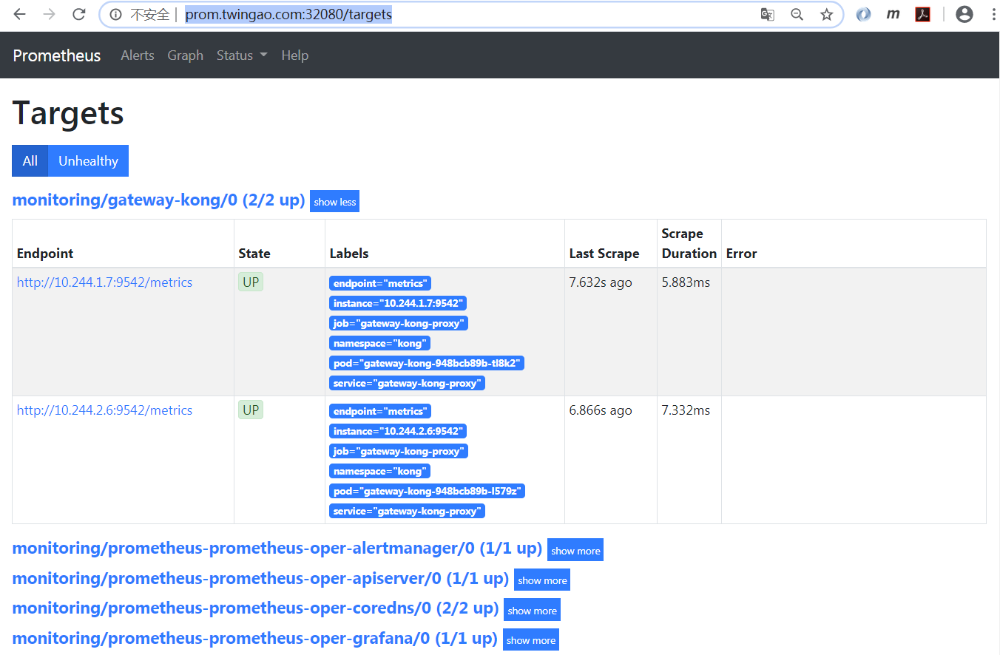
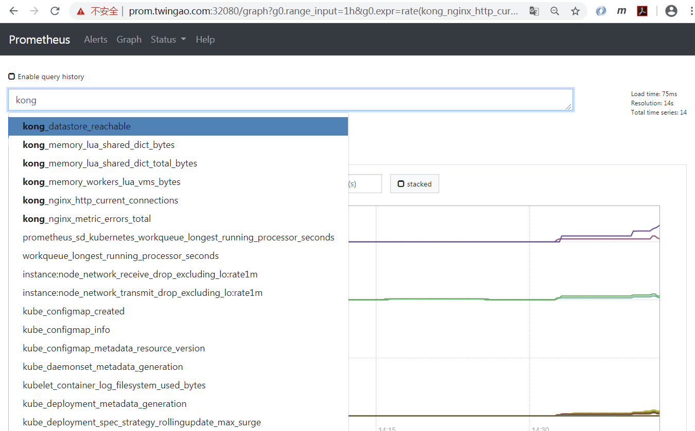
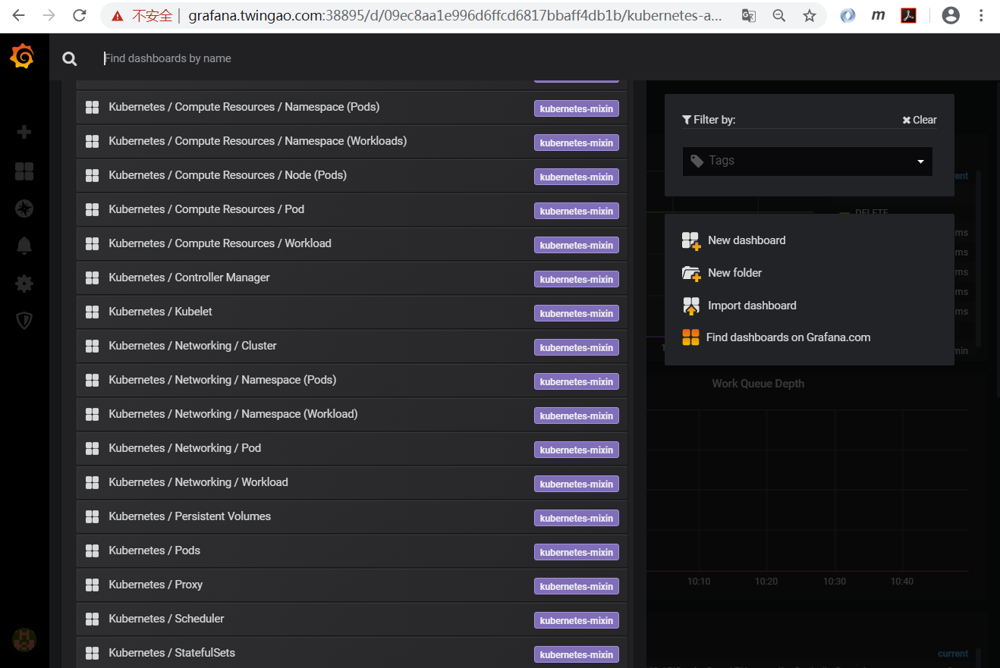
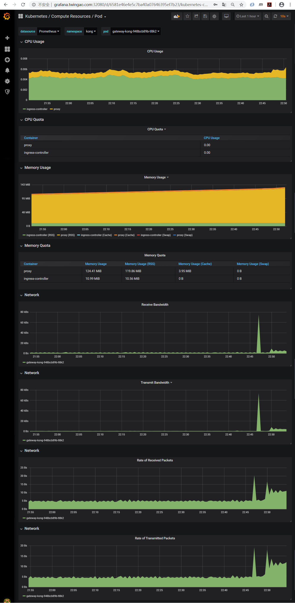
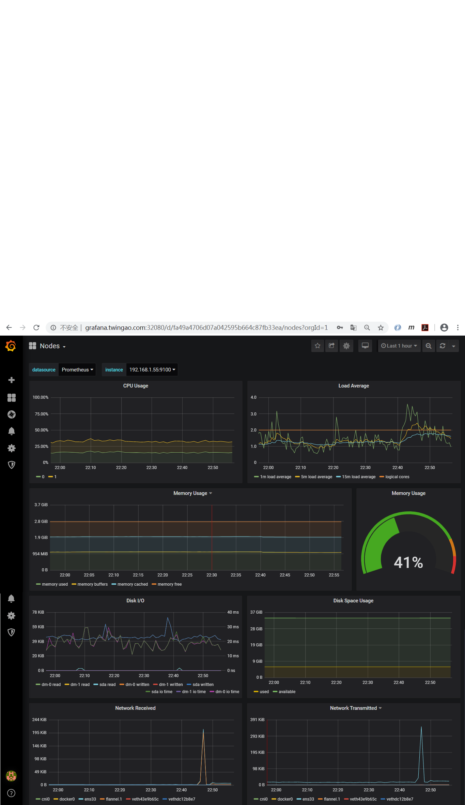

# Kong系列-16-Prometheus Operator监控Kong

Prometheus Operatorde的安装部署见[Helm部署Prometheus Operator和自定义监控](../prometheus/helm-prometheus-operator.md)。

    kubectl get prometheuses.monitoring.coreos.com/prometheus-prometheus-oper-prometheus -nmonitoring -oyaml
    apiVersion: monitoring.coreos.com/v1
    kind: Prometheus
    metadata:
      creationTimestamp: "2020-04-02T13:30:14Z"
      generation: 1
      labels:
        app: prometheus-operator-prometheus
        chart: prometheus-operator-8.5.0
        heritage: Helm
        release: prometheus
      name: prometheus-prometheus-oper-prometheus
      namespace: monitoring
      resourceVersion: "10588"
      selfLink: /apis/monitoring.coreos.com/v1/namespaces/monitoring/prometheuses/prometheus-prometheus-oper-prometheus
      uid: 19effbef-4d5e-46fe-96ac-2202f1fc0e4d
    spec:
      alerting:
        alertmanagers:
        - name: prometheus-prometheus-oper-alertmanager
          namespace: monitoring
          pathPrefix: /
          port: web
      baseImage: quay.io/prometheus/prometheus
      enableAdminAPI: false
      externalUrl: http://prometheus-prometheus-oper-prometheus.monitoring:9090
      listenLocal: false
      logFormat: logfmt
      logLevel: info
      paused: false
      podMonitorNamespaceSelector: {}
      podMonitorSelector:
        matchLabels:
          release: prometheus
      portName: web
      replicas: 1
      retention: 10d
      routePrefix: /
      ruleNamespaceSelector: {}
      ruleSelector:
        matchLabels:
          app: prometheus-operator
          release: prometheus
      secrets:
      - etcd-certs
      securityContext:
        fsGroup: 2000
        runAsNonRoot: true
        runAsUser: 1000
      serviceAccountName: prometheus-prometheus-oper-prometheus
      serviceMonitorNamespaceSelector: {}
      serviceMonitorSelector:
        matchLabels:
          release: prometheus
      version: v2.13.1

几个关键信息点：
- Prometheus Operator部署在命名空间monitoring。
- `serviceMonitorSelector.matchLabels.release=prometheus`表示ServiceMonitor中需要有标签`release: prometheus`。

Kong的安装部署参见[Kong系列-03-Helm安装Kong 1.3.0 DB-less with Ingress Controller](03-kong-helm-db-less.md)，本文安装最新版本。

    helm repo add kong https://charts.konghq.com
    helm search repo kong
    NAME            CHART VERSION   APP VERSION     DESCRIPTION
    kong/kong       1.4.1           2               The Cloud-Native Ingress and API-management
    stable/kong     0.32.0          1.4             The Cloud-Native Ingress and Service Mesh for A...

serviceMonitor需要创建在monitoring命名空间，serviceMonitor中增加标签`release: prometheus`。

    kubectl create namespace kong
    helm install gateway kong/kong \
      --version 1.4.1 \
      --namespace kong \
      --set proxy.type=NodePort \
      --set proxy.http.nodePort=32080 \
      --set proxy.tls.nodePort=32443 \
      --set ingressController.installCRDs=false \
      --set replicaCount=2 \
      --set serviceMonitor.enabled=true \
      --set serviceMonitor.interval=10s \
      --set serviceMonitor.namespace=monitoring \
      --set serviceMonitor.labels.release=prometheus

    # ??????????????????????????????????????
    helm upgrade gateway kong/kong \
      --version 1.4.1 \
      --namespace kong \
      --set proxy.type=NodePort \
      --set proxy.http.nodePort=32080 \
      --set proxy.tls.nodePort=32443 \
      --set ingressController.installCRDs=false \
      --set replicaCount=2 \
      --set serviceMonitor.enabled=true \
      --set serviceMonitor.interval=10s \
      --set serviceMonitor.namespace=monitoring \
      --set serviceMonitor.labels.release=prometheus \
      --set admin.enabled=true \
      --set admin.http.enabled=true \
      --set admin.http.enabled=true

    kubectl get all -nkong
    NAME                               READY   STATUS    RESTARTS   AGE
    pod/gateway-kong-948bcb89b-clswt   2/2     Running   2          19m
    pod/gateway-kong-948bcb89b-k8g64   2/2     Running   2          19m
    
    NAME                         TYPE       CLUSTER-IP    EXTERNAL-IP   PORT(S)                      AGE
    service/gateway-kong-proxy   NodePort   10.1.104.72   <none>        80:32080/TCP,443:32443/TCP   19m
    
    NAME                           READY   UP-TO-DATE   AVAILABLE   AGE
    deployment.apps/gateway-kong   2/2     2            2           19m
    
    NAME                                     DESIRED   CURRENT   READY   AGE
    replicaset.apps/gateway-kong-948bcb89b   2         2         2       19m

注意到gateway-kong-proxy服务并没有公开metrics（9542）端口，但仍然可以以ServiceMonitor进行监控，这一点没有很理解。

    kubectl get service/gateway-kong-proxy -nkong -oyaml
    apiVersion: v1
    kind: Service
    metadata:
      creationTimestamp: "2020-04-02T13:41:07Z"
      labels:
        app.kubernetes.io/instance: gateway
        app.kubernetes.io/managed-by: Helm
        app.kubernetes.io/name: kong
        app.kubernetes.io/version: "2"
        helm.sh/chart: kong-1.4.1
      name: gateway-kong-proxy
      namespace: kong
      resourceVersion: "11808"
      selfLink: /api/v1/namespaces/kong/services/gateway-kong-proxy
      uid: a8ceebb2-c3ed-442c-882e-2969395be430
    spec:
      clusterIP: 10.1.205.101
      externalTrafficPolicy: Cluster
      ports:
      - name: kong-proxy
        nodePort: 32080
        port: 80
        protocol: TCP
        targetPort: 8000
      - name: kong-proxy-tls
        nodePort: 32443
        port: 443
        protocol: TCP
        targetPort: 8443
      selector:
        app.kubernetes.io/component: app
        app.kubernetes.io/instance: gateway
        app.kubernetes.io/name: kong
      sessionAffinity: None
      type: NodePort
    status:
      loadBalancer: {}

我们直接通过Pod访问metrics，是可以访问的，但感觉指标很少啊。？？？？？？？？？？？？？？？？？？？？

    kubectl get pod -nkong -owide
    NAME                           READY   STATUS    RESTARTS   AGE     IP           NODE        NOMINATED NODE   READINESS GATES
    gateway-kong-948bcb89b-clswt   2/2     Running   2          8m53s   10.244.1.8   k8s-node1   <none>           <none>
    gateway-kong-948bcb89b-k8g64   2/2     Running   2          8m53s   10.244.2.7   k8s-node2   <none>           <none>

    curl http://10.244.1.8:9542/metrics
    # HELP kong_datastore_reachable Datastore reachable from Kong, 0 is unreachable
    # TYPE kong_datastore_reachable gauge
    kong_datastore_reachable 1
    # HELP kong_memory_lua_shared_dict_bytes Allocated slabs in bytes in a shared_dict
    # TYPE kong_memory_lua_shared_dict_bytes gauge
    kong_memory_lua_shared_dict_bytes{shared_dict="kong"} 40960
    kong_memory_lua_shared_dict_bytes{shared_dict="kong_cluster_events"} 40960
    kong_memory_lua_shared_dict_bytes{shared_dict="kong_core_db_cache"} 798720
    kong_memory_lua_shared_dict_bytes{shared_dict="kong_core_db_cache_2"} 798720
    kong_memory_lua_shared_dict_bytes{shared_dict="kong_core_db_cache_miss"} 86016
    kong_memory_lua_shared_dict_bytes{shared_dict="kong_core_db_cache_miss_2"} 86016
    kong_memory_lua_shared_dict_bytes{shared_dict="kong_db_cache"} 794624
    kong_memory_lua_shared_dict_bytes{shared_dict="kong_db_cache_2"} 794624
    kong_memory_lua_shared_dict_bytes{shared_dict="kong_db_cache_miss"} 86016
    kong_memory_lua_shared_dict_bytes{shared_dict="kong_db_cache_miss_2"} 86016
    kong_memory_lua_shared_dict_bytes{shared_dict="kong_healthchecks"} 40960
    kong_memory_lua_shared_dict_bytes{shared_dict="kong_locks"} 61440
    kong_memory_lua_shared_dict_bytes{shared_dict="kong_process_events"} 45056
    kong_memory_lua_shared_dict_bytes{shared_dict="kong_rate_limiting_counters"} 86016
    kong_memory_lua_shared_dict_bytes{shared_dict="prometheus_metrics"} 49152
    # HELP kong_memory_lua_shared_dict_total_bytes Total capacity in bytes of a shared_dict
    # TYPE kong_memory_lua_shared_dict_total_bytes gauge
    kong_memory_lua_shared_dict_total_bytes{shared_dict="kong"} 5242880
    kong_memory_lua_shared_dict_total_bytes{shared_dict="kong_cluster_events"} 5242880
    kong_memory_lua_shared_dict_total_bytes{shared_dict="kong_core_db_cache"} 134217728
    kong_memory_lua_shared_dict_total_bytes{shared_dict="kong_core_db_cache_2"} 134217728
    kong_memory_lua_shared_dict_total_bytes{shared_dict="kong_core_db_cache_miss"} 12582912
    kong_memory_lua_shared_dict_total_bytes{shared_dict="kong_core_db_cache_miss_2"} 12582912
    kong_memory_lua_shared_dict_total_bytes{shared_dict="kong_db_cache"} 134217728
    kong_memory_lua_shared_dict_total_bytes{shared_dict="kong_db_cache_2"} 134217728
    kong_memory_lua_shared_dict_total_bytes{shared_dict="kong_db_cache_miss"} 12582912
    kong_memory_lua_shared_dict_total_bytes{shared_dict="kong_db_cache_miss_2"} 12582912
    kong_memory_lua_shared_dict_total_bytes{shared_dict="kong_healthchecks"} 5242880
    kong_memory_lua_shared_dict_total_bytes{shared_dict="kong_locks"} 8388608
    kong_memory_lua_shared_dict_total_bytes{shared_dict="kong_process_events"} 5242880
    kong_memory_lua_shared_dict_total_bytes{shared_dict="kong_rate_limiting_counters"} 12582912
    kong_memory_lua_shared_dict_total_bytes{shared_dict="prometheus_metrics"} 5242880
    # HELP kong_memory_workers_lua_vms_bytes Allocated bytes in worker Lua VM
    # TYPE kong_memory_workers_lua_vms_bytes gauge
    kong_memory_workers_lua_vms_bytes{pid="22"} 52732
    # HELP kong_nginx_http_current_connections Number of HTTP connections
    # TYPE kong_nginx_http_current_connections gauge
    kong_nginx_http_current_connections{state="accepted"} 112
    kong_nginx_http_current_connections{state="active"} 2
    kong_nginx_http_current_connections{state="handled"} 112
    kong_nginx_http_current_connections{state="reading"} 0
    kong_nginx_http_current_connections{state="total"} 162
    kong_nginx_http_current_connections{state="waiting"} 1
    kong_nginx_http_current_connections{state="writing"} 1
    # HELP kong_nginx_metric_errors_total Number of nginx-lua-prometheus errors
    # TYPE kong_nginx_metric_errors_total counter
    kong_nginx_metric_errors_total 0

可以看一下gateway-kong的ServiceMonitor。

    kubectl get servicemonitors.monitoring.coreos.com gateway-kong -nmonitoring -oyaml
    apiVersion: monitoring.coreos.com/v1
    kind: ServiceMonitor
    metadata:
      creationTimestamp: "2020-04-02T13:41:07Z"
      generation: 1
      labels:
        app.kubernetes.io/instance: gateway
        app.kubernetes.io/managed-by: Helm
        app.kubernetes.io/name: kong
        app.kubernetes.io/version: "2"
        helm.sh/chart: kong-1.4.1
        release: prometheus
      name: gateway-kong
      namespace: monitoring
      resourceVersion: "11814"
      selfLink: /apis/monitoring.coreos.com/v1/namespaces/monitoring/servicemonitors/gateway-kong
      uid: 660eed83-2bef-4492-8748-edc3e5eee8d9
    spec:
      endpoints:
      - interval: 10s
        scheme: http
        targetPort: metrics
      jobLabel: gateway
      namespaceSelector:
        matchNames:
        - kong
      selector:
        matchLabels:
          app.kubernetes.io/instance: gateway
          app.kubernetes.io/managed-by: Helm
          app.kubernetes.io/name: kong
          app.kubernetes.io/version: "2"
          helm.sh/chart: kong-1.4.1

为Prometheus、Grafana和Alertmanager配置Ingress。

    vi prometheus-ingress.yaml
    apiVersion: extensions/v1beta1
    kind: Ingress
    metadata:
      name: prometheus-ingress
      namespace: monitoring
    spec:
      rules:
      - host: prom.twingao.com
        http:
          paths:
          - path: /
            backend:
              serviceName: prometheus-prometheus-oper-prometheus
              servicePort: 9090
      - host: grafana.twingao.com
        http:
          paths:
          - path: /
            backend:
              serviceName: prometheus-grafana
              servicePort: 80
      - host: alert.twingao.com
        http:
          paths:
          - path: /
            backend:
              serviceName: prometheus-prometheus-oper-alertmanager
              servicePort: 9093
    
    kubectl apply -f prometheus-ingress.yaml

在浏览器主机增加hosts，Windows系统在`C:\Windows\System32\drivers\etc\hosts`。

    # Prometheus Start
    192.168.1.55 prom.twingao.com
    192.168.1.55 grafana.twingao.com
    192.168.1.55 alert.twingao.com
    # Prometheus End

访问Prometheus，地址[http://prom.twingao.com:32080/targets](http://prom.twingao.com:32080/targets)。

也可以看到Kong的指标。

访问Alertmanager，地址：[http://alert.twingao.com:32080/#/alerts](http://alert.twingao.com:32080/#/alerts)。

访问Grafana，地址[http://grafana.twingao.com:32080/](http://grafana.twingao.com:32080/)，缺省密码为`prom-operator`，获取方式：

    helm show values stable/prometheus-operator | grep adminPassword
      adminPassword: prom-operator

Grafana缺省内置了多个dashboard。

Grafana能够自动探测到Pod，并对Pod从CPU、内存、网络多个方面进行监控。

Grafana能够对Kubernetes的各个Node节点从CPU、内存、负载、磁盘I/O、磁盘使用率和网络多个方面进行监控。

vi prometheus-plugin.yaml
---
apiVersion: configuration.konghq.com/v1
kind: KongPlugin
metadata:
  name: prometheus-plugin
plugin: prometheus

kubectl apply -f prometheus-plugin.yaml

kubectl patch service prometheus-grafana -p '{"metadata":{"annotations":{"plugins.konghq.com":"prometheus-plugin"}}}' -nmonitoring

我们从service/ambassador-admin抓取metrics，查看一下ports。

    kubectl get service/ambassador-admin -oyaml -nambassador
    apiVersion: v1
    kind: Service
    metadata:
      creationTimestamp: "2020-04-01T13:34:28Z"
      labels:
        app.kubernetes.io/instance: ambassador
        app.kubernetes.io/managed-by: Helm
        app.kubernetes.io/name: ambassador
        app.kubernetes.io/part-of: ambassador
        helm.sh/chart: ambassador-6.2.2
        product: aes
        service: ambassador-admin
      name: ambassador-admin
      namespace: ambassador
      resourceVersion: "74460"
      selfLink: /api/v1/namespaces/ambassador/services/ambassador-admin
      uid: 85a6c036-0e5e-4abb-bfd8-70c8956d305e
    spec:
      clusterIP: 10.1.104.26
      ports:
      - name: ambassador-admin
        port: 8877
        protocol: TCP
        targetPort: admin
      selector:
        app.kubernetes.io/instance: ambassador
        app.kubernetes.io/name: ambassador
      sessionAffinity: None
      type: ClusterIP
    status:
      loadBalancer: {}

查看Prometheus自定义资源，其中定义了`serviceMonitorSelector.matchLabels=release: prometheus`，Prometheus据此关联ServiceMonitor。

    kubectl get prometheuses.monitoring.coreos.com/prometheus-prometheus-oper-prometheus -nmonitoring -oyaml
    apiVersion: monitoring.coreos.com/v1
    kind: Prometheus
    metadata:
      creationTimestamp: "2020-04-01T01:43:35Z"
      generation: 1
      labels:
        app: prometheus-operator-prometheus
        chart: prometheus-operator-8.5.0
        heritage: Helm
        release: prometheus
      name: prometheus-prometheus-oper-prometheus
      namespace: monitoring
      resourceVersion: "14492"
      selfLink: /apis/monitoring.coreos.com/v1/namespaces/monitoring/prometheuses/prometheus-prometheus-oper-prometheus
      uid: 2b97c71a-5ec6-41bf-a42a-565136821ae5
    spec:
      alerting:
        alertmanagers:
        - name: prometheus-prometheus-oper-alertmanager
          namespace: monitoring
          pathPrefix: /
          port: web
      baseImage: quay.io/prometheus/prometheus
      enableAdminAPI: false
      externalUrl: http://prometheus-prometheus-oper-prometheus.monitoring:9090
      listenLocal: false
      logFormat: logfmt
      logLevel: info
      paused: false
      podMonitorNamespaceSelector: {}
      podMonitorSelector:
        matchLabels:
          release: prometheus
      portName: web
      replicas: 1
      retention: 10d
      routePrefix: /
      ruleNamespaceSelector: {}
      ruleSelector:
        matchLabels:
          app: prometheus-operator
          release: prometheus
      securityContext:
        fsGroup: 2000
        runAsNonRoot: true
        runAsUser: 1000
      serviceAccountName: prometheus-prometheus-oper-prometheus
      serviceMonitorNamespaceSelector: {}
      serviceMonitorSelector:
        matchLabels:
          release: prometheus
      version: v2.13.1

创建ServiceMonitor。其中几个需要注意的关键点。
- ServiceMonitor的name最终会反应到Prometheus的配置中，作为job_name。
- 由于Prometheus自定义资源中定义了`serviceMonitorSelector.matchLabels=release: prometheus`，表示ServiceMonitor需要定义一个标签release: prometheus，Prometheus据此可以关联ServiceMonitor。
- ServiceMonitor的命名空间必须和Prometheus所在的命名空间相同，此处为monitoring。
- endpoints.port需要和Service中的拉取metrics的ports.name对应，此处和上面对应为ambassador-admin。
- namespaceSelector.matchNames需要和被监控的Service所在的命名空间相同，此处为ambassador。
- selector.matchLabels的标签必须和被监控的Service中能唯一标明身份的标签对应。

创建ambassador-admin服务对应的ServiceMonitor。

    vi prometheus-serviceMonitorAmbassador.yaml
    ---
    apiVersion: monitoring.coreos.com/v1
    kind: ServiceMonitor
    metadata:
      name: ambassador-monitor
      labels:
        release: prometheus
      namespace: monitoring
    spec:
      endpoints:
      - port: ambassador-admin
      namespaceSelector:
        matchNames:
        - ambassador
      selector:
        matchLabels:
          service: ambassador-admin

    kubectl apply -f prometheus-serviceMonitorAmbassador.yaml

Prometheus的Targets。

Prometheus监控指标每分钟的请求数`rate(envoy_http_rq_total[1m])`。

可以从Grafana的Dashboard模板[https://grafana.com/grafana/dashboards](https://grafana.com/grafana/dashboards)中下载Ambassador相关Dashboard。可以下载第一个模板。

在Grafana将该Dashboard上传上去，能够从多个方面监控。

由于Ambassador是基于envoy开发的，其metrics也是从envoy直接拉取的。我们也可以使用envoy的Dashboard。我们可以参考这些Dashboard模板，然后结合metrics，开发适合自己的Dashboard。

